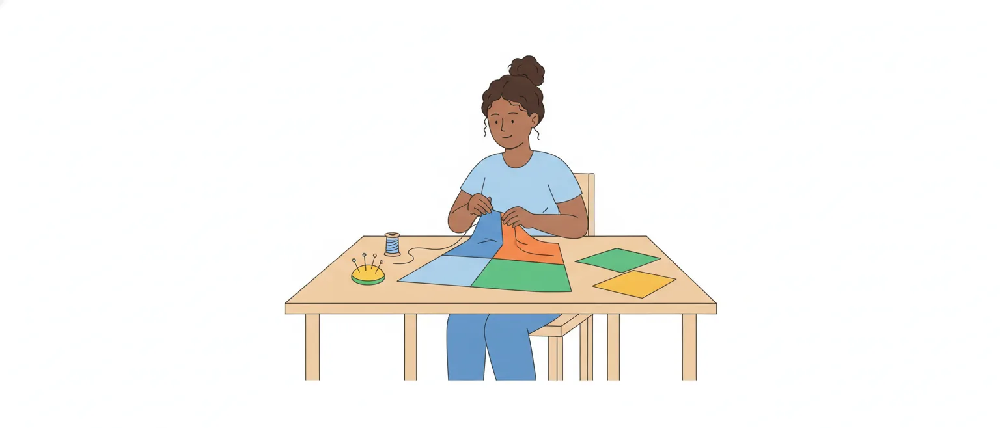

# Coesão, coerência e uso de conectores

O edital pede "Estruturação Textual: coesão, coerência e uso de conectores" (item 3.1). Na prova, isso vira três tipos de item, quase sempre com a linha do texto indicada:

1. **a que termo uma palavra se refere** ("o pronome 'lhes', na linha 5, retoma…");
2. **que ideia um conector exprime** ("'pois' introduz uma conclusão");
3. **se a troca de um conector por outro mantém o sentido e a correção**.

Esta aula trata do sentido dos conectores e das retomadas. O nome das orações (coordenada, subordinada) fica para a aula de coordenação e subordinação.

## Coesão e coerência não são a mesma coisa

**Coesão** é a ligação que se vê nas palavras: o pronome que retoma um nome, o conector que une duas frases. **Coerência** é o sentido do conjunto: as ideias combinam entre si e com o que sabemos do mundo.

Um texto pode ter muita "cola" e nenhum sentido:

> O Conselho fica em Palmas. Essa cidade é a capital do Tocantins; portanto, os boletos vencem em março. Além disso, eles são azuis, porque a reunião terminou cedo.

Há pronomes e conectores por toda parte (*essa*, *portanto*, *além disso*, *eles*, *porque*), mas ser capital não leva ao vencimento de boleto nenhum. É um texto **coeso e incoerente**.

O contrário também existe: *Chuva forte. Ruas alagadas. Atendimento suspenso.* Nenhum conector, e todo mundo entende que uma coisa causou a outra. É um texto **coerente com pouca coesão**.

> [!IMPORTANT]
> Conector certo na gramática não garante sentido. Quando o item pergunta se uma troca "mantém a coerência", o que ele quer saber é se a relação entre as ideias continua a mesma.

## Retomar e antecipar

A coesão **referencial** é feita por palavras que apontam para outra parte do texto. Elas evitam a repetição e amarram as frases.

- **Anáfora**: a palavra retoma algo que **já foi dito**. *A fiscal chegou cedo. **Ela** trouxe os relatórios.*
- **Catáfora**: a palavra anuncia algo que **ainda vai ser dito**. *O edital exige **isto**: diploma e documento com foto.*

A anáfora é muito mais comum. Por isso, a banca gosta de afirmar que um termo tem "função catafórica" quando ele só retoma.

> [!TIP]
> Catáfora costuma vir antes de dois-pontos ou de uma explicação: *o problema é **este**: …*, *só peço **uma coisa**: …*

## Os recursos de retomada

Um termo pode ser retomado de vários jeitos:

- **Pronome**: *A certidão ficou pronta. O servidor **a** entregou ontem.*
- **Sinônimo** (palavra de sentido parecido): *A sessão começou às 9h. **A reunião** durou duas horas.*
- **Hiperônimo** (palavra de sentido mais geral, que inclui a outra): *A certidão ficou pronta. **O documento** segue por e-mail.* Certidão é um tipo de documento. O contrário é o **hipônimo**, a palavra mais específica.
- **Expressão equivalente**: *Palmas recebeu o encontro. **A capital do Tocantins** hospedou 300 participantes.*
- **Elipse** (o termo é omitido, e o leitor o recupera): *A servidora abriu o processo e conferiu os anexos.* Quem conferiu? A servidora: o sujeito do segundo verbo não foi escrito.
- **Advérbio**: *O arquivo fica no subsolo. **Lá** estão os processos antigos.*

Três pronomes pedem atenção, porque mudam de forma conforme o termo retomado:

- ***o, a, os, as*** retomam o complemento sem preposição: *recebeu os pedidos e **os** analisou*;
- ***lhe, lhes*** valem por "a ele(s)", "a ela(s)": *chamou os candidatos e entregou-**lhes** o caderno*;
- ***seu, sua*** indicam posse e podem gerar dúvida: em *O diretor avisou o fiscal de que seu relatório atrasou*, o relatório é do diretor ou do fiscal?

> [!CAUTION]
> ***Isso*** muitas vezes retoma **uma frase inteira**, e não um substantivo: *O sistema caiu duas vezes. **Isso** atrasou a emissão dos boletos.* O que atrasou foi o fato de o sistema cair.

## Este, esse, aquele

Dentro do texto, o Manual de Redação da Presidência ensina assim:

- ***este, esta, isto*** apontam para o que **ainda vai ser dito** (e para o próprio texto): *A regra é **esta**: sem documento, não há atendimento.*
- ***esse, essa, isso*** apontam para o que **já foi dito**: *Sem documento, não há atendimento. **Essa** regra vale para todos.*

Quando há **dois termos** para retomar, usa-se o par *este* × *aquele*:

- ***este*** retoma o termo **mais próximo** (o último citado);
- ***aquele*** retoma o **mais distante** (o primeiro citado).

*O Conselho contratou uma arquiteta e um contador: **este** cuidará das contas; **aquela**, da fiscalização.* "Este" é o contador, citado por último; "aquela" é a arquiteta.

> [!NOTE]
> Nem todo texto de prova segue a distinção entre *este* e *esse*. No item, não marque só pela forma do pronome: confira o referente pelo sentido.

## "Que", "o qual", "cujo" e "onde"

Os pronomes relativos retomam um termo que veio **antes** deles e abrem uma nova oração.

- ***Que*** retoma, em geral, o nome que está logo antes: *os profissionais **que** moram no interior* (que = os profissionais).
- ***O qual*** (*a qual, os quais, as quais*) faz o mesmo, mas mostra gênero e número. Serve para desfazer dúvida: em *a irmã do conselheiro, **que** assinou o parecer*, quem assinou? Com *a qual*, foi a irmã; com *o qual*, o conselheiro.
- ***Cujo*** indica **posse**. Fica entre o dono (antes) e a coisa possuída (depois) e concorda com a coisa possuída: *a empresa **cujo** registro foi suspenso* (= o registro da empresa). Nunca vem seguido de artigo: "cujo o registro" é erro.
- ***Onde*** só retoma **lugar**: *a sala **onde** ocorre a reunião* (= em que, na qual). Em *a reunião onde se decidiu o reajuste*, o certo é *em que*: reunião não é lugar.

> [!WARNING]
> Com *cujo*, o item costuma trocar os papéis. O termo **retomado** é o que vem antes (o dono); o termo com que *cujo* **concorda** é o que vem depois.

## Como achar o referente: passo a passo

O item diz: "na linha 7, o pronome 'os' retoma 'os prazos'". Faça assim:

1. **Vá à linha** e leia a frase inteira, mais a frase anterior.
2. **Olhe a forma do pronome**: masculino ou feminino? Singular ou plural? *Lhes* pede um plural; *a* pede um feminino singular.
3. **Procure para trás** os termos que combinam com essa forma. Com pronome relativo, comece pelo termo que está logo antes dele.
4. **Troque o pronome pelo candidato** e releia. *Entregou-lhes o caderno* → *entregou aos candidatos o caderno*. Fez sentido? É esse.
5. **Confira o que mais o item afirma.** Se houver uma segunda parte ("…, o que mostra que…", "…, motivo pelo qual…"), ela também precisa estar certa.

> [!CAUTION]
> Item de duas partes: a banca acerta o referente e erra a conclusão tirada dele. Uma parte errada basta para o item inteiro estar errado.

## Os conectores e seus valores

A coesão **sequencial** faz o texto andar: liga uma ideia à seguinte e diz que relação existe entre elas. Quem faz isso são os conectores (conjunções, locuções e algumas preposições).

O mesmo par de fatos muda de sentido conforme o conector:

- *Choveu, **e** o evento foi adiado.* (soma de fatos)
- *Choveu; **por isso**, o evento foi adiado.* (conclusão)
- *Choveu, **mas** o evento não foi adiado.* (oposição)

![Quadro com treze valores e os conectores de cada um. Adição: e, nem, além disso, não só… mas também. Oposição: mas, porém, contudo, todavia, entretanto, no entanto. Concessão: embora, ainda que, mesmo que, conquanto, posto que, apesar de. Causa: porque, já que, visto que, uma vez que, porquanto, como (no início), na medida em que. Explicação: pois (antes do verbo), porque, que. Conclusão: portanto, logo, por isso, assim, pois (depois do verbo). Consequência: tão… que, tanto… que, de modo que. Condição: se, caso, desde que, contanto que, a menos que. Finalidade: para que, a fim de que, para, a fim de. Tempo: quando, assim que, logo que, depois que, enquanto. Comparação: como, mais… do que, tanto quanto, assim como. Conformidade: conforme, segundo, consoante, como. Proporção: à medida que, à proporção que, quanto mais… mais.](imagens/mapa-dos-conectores.svg "Os treze valores e os conectores mais comuns de cada um")

Um exemplo de cada valor:

- **Adição**: *O portal emite boletos **e** certidões.*
- **Oposição**: *O prazo acabou, **mas** o sistema ainda aceita pedidos.*
- **Concessão**: ***Embora** o prazo tenha acabado, o sistema ainda aceita pedidos.*
- **Causa**: *A sessão foi adiada **porque** não houve quórum.*
- **Explicação**: *Leve o documento, **pois** a portaria vai pedi-lo.*
- **Conclusão**: *Não houve quórum; **portanto**, a sessão foi adiada.*
- **Consequência**: *A fila era **tão** longa **que** dobrava a esquina.*
- **Condição**: ***Se** o boleto vencer, emita a segunda via.*
- **Finalidade**: *O Conselho abriu um canal **para que** os profissionais tirem dúvidas.*
- **Tempo**: ***Quando** o resultado sair, a lista será publicada.*
- **Comparação**: *O novo portal é mais rápido **do que** o antigo.*
- **Conformidade**: *O registro foi feito **conforme** manda a resolução.*
- **Proporção**: ***À medida que** os pedidos chegam, a equipe os distribui.*

> [!TIP]
> Não decore listas soltas. Guarde **um conector-modelo por valor** (*mas*, *embora*, *porque*, *portanto*, *se*…) e pergunte: o conector do item pode ser trocado pelo modelo?

## Causa, conclusão e consequência

Esses três valores falam da mesma relação, vista de lados diferentes. A pergunta é: **o conector está grudado em qual das duas ideias?**

- Na **causa** (o motivo): *A sessão foi adiada **porque** não houve quórum.*
- Na **conclusão** (o resultado): *Não houve quórum; **por isso**, a sessão foi adiada.*

Daí o erro de trocar *por isso* por *porque* (ou por *porquanto*, que é a mesma coisa). A troca vira a relação do avesso: *Não houve quórum, porque a sessão foi adiada* diz que o adiamento causou a falta de quórum.

A **explicação** é vizinha da causa: justifica o que acabou de ser dito, muitas vezes uma ordem ou um palpite (*Deve ter chovido, **pois** a rua está molhada*). A diferença entre as duas é assunto da aula de coordenação e subordinação; aqui basta saber que *porque*, *pois* e *porquanto* servem às duas e **nunca** indicam conclusão.

## Conectores que enganam

Alguns conectores parecem dizer uma coisa e dizem outra. São os preferidos da banca nas trocas.

| Conector | Vale por | Ideia | Parece, mas não é |
|---|---|---|---|
| **porquanto** | porque | causa | *portanto* (conclusão) |
| **conquanto** | embora | concessão | *conforme*, *enquanto* |
| **posto que** | embora | concessão | causa ("já que") |
| **contudo** | mas | oposição | conclusão, adição |
| **não obstante** | apesar disso, apesar de | contraste | causa, conclusão |
| **à medida que** | à proporção que | proporção | causa |
| **na medida em que** | porque, uma vez que | causa | proporção |
| **visto que** | porque | causa | tempo, conclusão |
| **uma vez que** | porque, já que | causa | tempo ("uma vez") |

Quatro avisos:

- ***Posto que***: na norma-padrão, vale por *embora* e pede verbo no subjuntivo (*posto que **seja** tarde*). O uso com sentido de "porque" é comum na fala e em textos informais, mas o Manual de Redação da Presidência e a maioria dos gramáticos não o aceitam.
- ***À medida que*** e ***na medida em que*** não se misturam. "À medida em que" e "na medida que" não existem na norma-padrão.
- ***Pois*** muda de valor conforme o lugar. No começo da oração, explica (= porque): *O atendimento parou, **pois** faltou energia.* Depois do verbo, entre vírgulas, conclui (= portanto): *Faltou energia; o atendimento foi, **pois**, suspenso.*
- ***Uma vez que***, com verbo no indicativo, indica causa: *O pedido foi negado, **uma vez que** faltava a assinatura.*

> [!NOTE]
> As listas das gramáticas não concordam em tudo. *Não obstante* aparece ora ao lado de *mas*, ora ao lado de *embora*; *enquanto*, ora como tempo, ora como proporção. Fique com o que é seguro: *não obstante* marca contraste, nunca causa nem conclusão; *enquanto* fala de dois fatos que acontecem juntos.

## Oposição e concessão: mesma ideia, outra construção

*Mas* e *embora* servem para a mesma coisa: pôr lado a lado um **obstáculo** e um **fato que acontece apesar dele**. A diferença está em onde o conector fica e no verbo que o acompanha.

- **Concessão**: o conector abre a oração do **obstáculo**, com verbo no **subjuntivo**. ***Embora** o prazo **seja** curto, a comissão concluiu o relatório.*
- **Oposição**: o conector abre a oração do **fato que prevalece**, com verbo no **indicativo**. *O prazo **é** curto; **contudo**, a comissão concluiu o relatório.*

![Duas faixas com o mesmo par de ideias: o obstáculo "o prazo é curto" e o fato que prevalece "a comissão concluiu o relatório". Na faixa da concessão, o conector "Embora" está na oração do obstáculo, com verbo no subjuntivo: "Embora o prazo seja curto, a comissão concluiu o relatório." Na faixa da oposição, o conector "contudo" está na oração do fato que prevalece, com verbo no indicativo: "O prazo é curto; contudo, a comissão concluiu o relatório." No pé da figura: trocar só a palavra, "Contudo o prazo seja curto, a comissão concluiu o relatório", está errado.](imagens/oposicao-e-concessao.svg "O conector muda de oração, e o verbo muda de modo")

Agora a pegadinha. O item propõe trocar **só a palavra**: *"Contudo o prazo seja curto, a comissão concluiu o relatório."* A frase fica errada: *contudo* não aceita o subjuntivo *seja* nem pode abrir a oração do obstáculo. A ideia de contraste é a mesma, mas **a correção gramatical se perde**.

Já a troca dentro do mesmo grupo funciona: *embora* por *ainda que*, *conquanto* ou *posto que* (todos com subjuntivo); *mas* por *porém*, *contudo*, *todavia*, *no entanto*, *entretanto* (todos com indicativo).

Outro par que pede ajuste no verbo é *se* × *caso*: ***Se** o sistema **cair**, ligue para o suporte* × ***Caso** o sistema **caia**, ligue para o suporte.* E *apesar de* pede infinitivo: ***Apesar de** o prazo **ser** curto…*

> [!IMPORTANT]
> "Mantém o sentido?" e "mantém a correção?" são **duas perguntas**. Uma troca pode passar numa e ser reprovada na outra.

## Trocar o conector: passo a passo

O item diz: "a substituição de 'por isso' (linha 9) por 'porquanto' manteria a correção gramatical e o sentido do texto". Faça assim:

1. **Dê nome à ideia do conector original.** Troque-o pelo conector-modelo: *por isso* = *portanto* → conclusão.
2. **Dê nome à ideia do conector novo.** *Porquanto* = *porque* → causa.
3. **Compare.** Ideias diferentes: o sentido mudou, item errado. Pode parar aqui.
4. **Se a ideia é a mesma, teste a construção.** O conector novo fica na mesma oração? Aceita o mesmo modo do verbo? Releia a frase com ele, em voz baixa.
5. **Releia o que o item pede.** Só o sentido? Só a correção? As duas coisas? Se pede as duas, basta uma falhar.

Dois exemplos resolvidos:

- *Embora* → *conquanto*: mesma ideia (concessão), mesma oração, mesmo subjuntivo. **Mantém** sentido e correção.
- *Embora* → *contudo*: mesma ideia de contraste, mas outra construção. **Não mantém** a correção.

> [!TIP]
> Na dúvida entre dois valores, leia a frase com o conector-modelo de cada um. O que soar absurdo sai.

## O que faz um texto coerente

A coerência não mora numa palavra: é do texto inteiro. Quatro perguntas ajudam a conferir.

1. **O assunto continua o mesmo?** Um texto coerente mantém o tema; mudança brusca de assunto quebra o fio.
2. **Há informação nova?** O texto precisa avançar (progressão). Repetir a mesma ideia com outras palavras não leva a lugar nenhum.
3. **Alguma parte desmente outra?** Dizer que o atendimento é "só pelo portal" e, adiante, que "o guichê recebe os pedidos" é contradição.
4. **A ligação entre as ideias faz sentido?** Aqui entram os conectores: um *portanto* onde caberia um *mas* torna o trecho incoerente, mesmo com a gramática em ordem.

Há ainda o que o leitor traz de fora: o **conhecimento de mundo**. *O evento foi ao ar livre; por isso, a chuva não atrapalhou* é estranho porque todos sabemos o que a chuva faz num evento sem teto.

> [!NOTE]
> Os autores não usam a mesma lista de fatores de coerência. Esta é uma seleção nossa, com o que mais aparece nas fontes consultadas: continuidade do tema, progressão, não contradição e relação lógica entre as ideias.

## Pegadinhas no estilo da banca

- Trocar um conector por outro **parecido no som e diferente no sentido**: *portanto* × *porquanto*, *conforme* × *conquanto*, *à medida que* × *na medida em que*.
- Propor *posto que* onde o texto traz *por isso* ou *porque*.
- Trocar *embora* por *contudo* (ou *mas* por *embora*) **sem mexer no resto da frase** e dizer que a correção se mantém.
- Dar ao *pois* do começo da oração o valor de conclusão.
- Apontar como referente um termo que está perto do pronome, mas **não combina em gênero ou número** com ele.
- Dizer que *cujo* retoma o termo que vem depois dele.
- Dizer que *isso* retoma um substantivo quando retoma a frase inteira (ou o contrário).
- Acertar o referente e emendar uma **conclusão que o texto não autoriza**.

## Fontes

- Presidência da República, *Manual de Redação da Presidência da República*, 3ª ed. (2018), itens 3.4 (coesão e coerência) e 11.10 (demonstrativos) e os verbetes "à medida que/na medida em que", "posto que" e "onde" (cópia hospedada pela UFGD): https://files.ufgd.edu.br/arquivos/arquivos/78/PROTOCOLO/Normas%20Internas/Manual%20de%20Reda%C3%A7%C3%A3o%20da%20Presid%C3%AAncia%20da%20Rep%C3%BAblica%20-%203%C2%AA%20edi%C3%A7%C3%A3o,%20revista,%20atualizada%20e%20ampliada.pdf
- Wanderson de Melo Gonçalves (NEAD/STJ), "EaDicas de Português, Dica 17 — Uso de conjunções": https://ead.stj.jus.br/pluginfile.php/105436/mod_resource/content/11/assets/files/2dica-17.pdf
- Superior Tribunal de Justiça (NEAD/STJ), "EaDicas de Português, Dica 29 — Uso do pronome relativo cujo": https://ead.stj.jus.br/pluginfile.php/105436/mod_resource/content/11/assets/files/2dica-29.pdf
- Senado Federal, Manual de Comunicação da Secom, "À medida que/na medida em que": https://www12.senado.leg.br/manualdecomunicacao/estilos/a-medida-que-na-medida-em-que
- Só Português (Virtuous), "Conjunções coordenativas" e as páginas seguintes, das subordinativas: https://www.soportugues.com.br/secoes/morf/morf85.php
- José Maria da Costa (Migalhas, coluna Gramatigalhas), "Posto que": https://www.migalhas.com.br/coluna/gramatigalhas/4444/posto-que
- Kassio Henrique Sobral Rocha (Estratégia Concursos), "O que é conjunção? Entenda o conceito e as suas classificações": https://www.estrategiaconcursos.com.br/blog/conjuncao/
- Warley Souza (Brasil Escola), "Coesão textual" e "Coerência textual": https://brasilescola.uol.com.br/redacao/coesao.htm e https://brasilescola.uol.com.br/redacao/coerencia.htm
- Warley Souza (Mundo Educação), "Coesão e coerência": https://mundoeducacao.uol.com.br/redacao/coesao-coerencia.htm
- Márcia Fernandes (Toda Matéria), "Coesão e Coerência" e "Pronomes Demonstrativos": https://www.todamateria.com.br/coesao-e-coerencia/ e https://www.todamateria.com.br/pronomes-demonstrativos/
- Lucas Lemos (Gran Cursos Online), "Coesão e coerência: diferenças, exemplos e exercícios": https://blog.grancursosonline.com.br/coesao-e-coerencia-diferencas-exemplos-e-exercicios/
