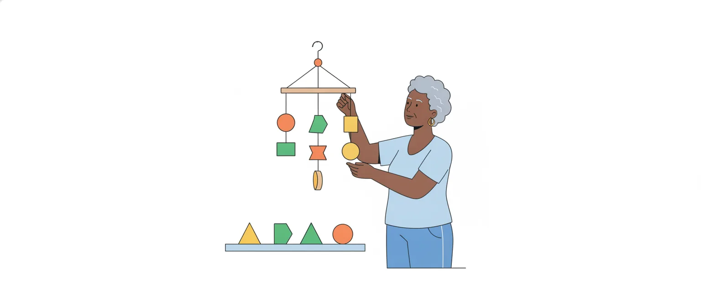

# Orações e períodos: coordenação e subordinação

O edital pede "estrutura de orações e períodos" e "relações de coordenação e subordinação" (itens 4.1 e 4.2). Na prática, a banca aponta um trecho do texto, com a linha, e pergunta **que função** aquele termo ou aquela oração exerce.

Na prova de 2023 do mesmo cargo, os três itens de sintaxe pediram a função de um termo (objeto direto, complemento nominal); nenhum pediu o nome completo de uma oração. Por isso esta aula dá testes de troca para achar a função e deixa as listas de nomes em tabelas, para consulta.

## Frase, oração e período

- **Frase**: todo enunciado de sentido completo, com verbo ou sem ele (*Silêncio!*).
- **Oração**: o enunciado que se organiza em torno de um verbo ou de uma locução verbal.
- **Período**: a frase feita de uma ou mais orações; termina em ponto, ponto de interrogação, ponto de exclamação ou reticências.

O período **simples** tem uma oração só (a oração absoluta). O período **composto** tem duas ou mais.

> [!TIP]
> Para saber quantas orações há num período, **conte os verbos**. A locução verbal (*vai emitir*, *foi aprovado*, *deve sair*, *tinha enviado*) conta uma vez só.

*A secretaria recebeu o pedido, conferiu os documentos e vai emitir a certidão*: três orações (*recebeu*, *conferiu*, *vai emitir*). O verbo no infinitivo, no gerúndio ou no particípio fora de locução também conta: *Encerrada a sessão, todos saíram* tem duas orações.

## Sujeito e predicado

**Sujeito** é o termo com o qual o verbo concorda; **predicado** é tudo o que se declara sobre ele, verbo incluído. Tipos de sujeito:

- **simples** (um núcleo): *O **plenário** aprovou a ata*;
- **composto** (dois ou mais núcleos): *O **presidente** e a **relatora** assinaram*;
- **oculto** (a terminação do verbo o indica): *Recebemos o ofício* (nós);
- **indeterminado**: verbo na 3ª pessoa do plural sem ninguém citado antes (*Ligaram da prefeitura*) ou verbo sem objeto direto na 3ª do singular + *se* (*Precisa-se de estagiários*).

**Oração sem sujeito**, com verbo sempre no singular: *haver* no sentido de existir (*Há vagas*), *fazer* e *haver* indicando tempo decorrido (*Faz dois anos*) e os fenômenos da natureza (*Choveu*).

O predicado é **nominal** quando traz verbo de ligação e uma qualidade do sujeito (*O prazo é curto*), **verbal** quando o núcleo é o próprio verbo (*O fiscal vistoriou a obra*) e **verbo-nominal** quando junta os dois (*A servidora saiu satisfeita*).

## Sujeito depois do verbo não é objeto

O sujeito nem sempre abre a frase. Ele costuma vir depois de verbos como *chegar, faltar, existir, sobrar, ocorrer* e na voz passiva:

- *Faltam **dois documentos**.*
- *Existem **vagas** no estacionamento.*
- *Foi publicado **o edital**.*
- *Analisam-se **os recursos** em dez dias.*

**Teste: mude o número do termo.** Se o verbo mudar junto, o termo é o sujeito: *Falta um documento* × *Faltam dois documentos*. Se o verbo ficar parado, não é: *Há uma vaga* × *Há dez vagas* (com *haver*, a oração não tem sujeito, e *vagas* é objeto direto).

> [!CAUTION]
> A banca chama de objeto direto o sujeito que vem depois do verbo. Antes de marcar, faça o teste do número.

## Objeto direto e objeto indireto

Os dois completam o **verbo**. O objeto direto liga-se a ele sem preposição; o indireto, com a preposição que o verbo exige.

**Teste: pergunte ao verbo.** *O fiscal entregou a notificação ao proprietário.*

- Entregou **o quê**? *A notificação*: objeto direto.
- Entregou **a quem**? *Ao proprietário*: objeto indireto.

Duas trocas confirmam:

- o objeto direto vira *o, a, os, as* (*entregou-**a***) e passa a sujeito na voz passiva (*A notificação foi entregue*);
- o objeto indireto de pessoa vira *lhe* (*entregou-**lhe** a notificação*).

Em *A equipe precisa de treinamento*, a pergunta é "precisa **de quê**?": objeto indireto. Não confunda com a circunstância de lugar, tempo ou modo, que o verbo não exige: *chegou **de Gurupi***, *saiu **às pressas*** (adjunto adverbial).

## Predicativo, agente da passiva e adjunto adverbial

- **Predicativo do sujeito**: qualidade ou estado do sujeito, por meio do verbo. *O parecer ficou **pronto***; *Os candidatos chegaram **ansiosos***.
- **Predicativo do objeto**: qualidade atribuída ao objeto. *O plenário considerou o recurso **procedente***.
- **Agente da passiva**: quem pratica a ação quando o verbo está na voz passiva; vem com *por*. *A ata foi assinada **pela relatora***. Na voz ativa, ele vira sujeito: *A relatora assinou a ata*.
- **Adjunto adverbial**: circunstância (tempo, lugar, modo, causa, finalidade) ligada ao verbo. *O Conselho atende **em Palmas**, **de segunda a sexta***.

> [!TIP]
> O adjunto adverbial pode mudar de lugar ou sair da frase sem que ela desmonte. O objeto e o predicativo, não.

## Complemento nominal ou adjunto adnominal

O **adjunto adnominal** acompanha um substantivo e o caracteriza: artigo, adjetivo, numeral, pronome ou locução adjetiva. Em *os dois novos guichês da sede*, tudo o que cerca *guichês* é adjunto adnominal.

O **complemento nominal** completa o sentido de um **nome** (substantivo abstrato, adjetivo ou advérbio), sempre com preposição: *necessidade **de reforma***, *contrário **à proposta***, *favoravelmente **ao pedido***.

A dúvida só aparece quando um termo com preposição se liga a um substantivo. Resolva em três passos, nesta ordem:

1. **O nome é adjetivo ou advérbio?** Complemento nominal. *A relatora foi fiel **às normas**.*
2. **É substantivo concreto** (pessoa, lugar, objeto)? Adjunto adnominal. *A porta **da sala**; o carro **do fiscal**; a mesa **de madeira**.*
3. **É substantivo abstrato de ação ou de sentimento?** Transforme-o em verbo. Se o termo **recebe** a ação, é complemento nominal: *a leitura **da ata*** (alguém lê a ata). Se **pratica** a ação ou é o dono dela, é adjunto adnominal: *a leitura **do secretário*** (o secretário lê).

![Três passos para decidir. Passo 1: o termo com preposição se liga a adjetivo ou advérbio ("contrário à proposta", "favoravelmente ao pedido"): complemento nominal. Passo 2: liga-se a substantivo concreto ("a porta da sala", "o carro do fiscal"): adjunto adnominal. Passo 3: liga-se a substantivo abstrato de ação ou de sentimento; transforme o substantivo em verbo: se o termo recebe a ação ("a leitura da ata", alguém lê a ata), complemento nominal; se pratica a ação ou é o dono ("a leitura do secretário", o secretário lê), adjunto adnominal. No pé: nem todo termo com "de" é complemento nominal.](imagens/complemento-nominal-ou-adjunto.svg "Complemento nominal ou adjunto adnominal: os três passos, com os exemplos desta aula")

Mais dois pares: *a aprovação **do parecer*** (o parecer é aprovado: complemento) × *a aprovação **do plenário*** (o plenário aprova: adjunto); *a resposta **ao ofício*** (complemento) × *a resposta **do Conselho*** (adjunto).

> [!WARNING]
> Há páginas muito acessadas na internet que tratam como complemento nominal todo termo com "de". Não é assim: *a demora **do sistema*** e *a decisão **do plenário*** trazem adjunto adnominal.

### Complemento nominal ou objeto indireto

Os dois vêm com preposição. O que muda é a palavra completada: o objeto indireto completa um **verbo** (*confia **no sistema***); o complemento nominal, um **nome** (*confiança **no sistema***, *confiante **no sistema***).

## Aposto e vocativo

- **Aposto** explica ou especifica um termo anterior e, em geral, vem entre vírgulas: *Palmas, **capital do Tocantins**, sedia o Conselho*.
- **Vocativo** é o chamamento. Não faz parte do sujeito nem do predicado e vem separado por vírgula: ***Senhora presidente**, a pauta está pronta*.

O vocativo no início da frase parece sujeito, mas o verbo não concorda com ele: em *Colegas, o prazo termina hoje*, o sujeito é *o prazo*.

## Coordenação e subordinação

No período composto, as orações se ligam de dois modos.

- **Coordenação**: as orações são independentes na sintaxe; nenhuma é termo da outra. *A equipe conferiu os dados **e** publicou a lista.*
- **Subordinação**: uma oração funciona como termo da outra, a principal: é o sujeito dela, o objeto, um adjunto. *A equipe informou **que a lista saiu**.*

![Árvore do período composto. O período composto, de duas ou mais orações, divide-se em coordenação e subordinação. Coordenação: orações independentes, nenhuma é termo da outra; pode ser assindética (sem conjunção, só vírgula ou ponto e vírgula) ou sindética (com conjunção), em cinco tipos: aditiva (e), adversativa (mas), alternativa (ou), conclusiva (portanto) e explicativa (pois). Subordinação: a oração subordinada funciona como um termo da principal; pode ser substantiva (vale por "isso": sujeito, objeto, complemento), adjetiva (vale por um adjetivo: adjunto adnominal) ou adverbial (indica circunstância: adjunto adverbial). Um período pode ter as duas relações: é o período misto.](imagens/arvore-do-periodo-composto.svg "O período composto: duas relações e três famílias de orações subordinadas")

> [!IMPORTANT]
> Toda oração subordinada exerce uma função sintática na principal. Achar essa função é o que a banca pede.

## Orações coordenadas

A coordenada **assindética** vem sem conjunção: *O atendente chamou a senha, conferiu o documento, entregou a certidão*. A **sindética** vem com conjunção e recebe o nome da ideia que a conjunção exprime.

| Tipo | Ideia | Conjunções | Exemplo |
|---|---|---|---|
| Aditiva | soma | *e, nem, não só… mas também* | *Pagou a taxa **e** enviou o comprovante.* |
| Adversativa | oposição | *mas, porém, contudo, todavia, entretanto, no entanto* | *Enviou o pedido, **mas** esqueceu o anexo.* |
| Alternativa | escolha ou alternância | *ou, ou… ou, ora… ora, quer… quer* | *Agende pelo portal **ou** ligue para a sede.* |
| Conclusiva | conclusão | *logo, portanto, por isso, pois* (depois do verbo) | *O prazo acabou; **portanto**, o pedido foi arquivado.* |
| Explicativa | justificativa | *pois* (antes do verbo), *porque, que* | *Aguarde na recepção, **pois** o atendente já volta.* |

O **pois** muda de valor com a posição. No início da oração, antes do verbo, justifica o que se disse (explicativo). Depois do verbo, entre vírgulas, vale por *portanto* (conclusivo): *O prazo terminou ontem; não aceitaremos, **pois**, o pedido*.

A lista de conectores por valor está na aula de coesão e coerência. Aqui importa a relação entre as orações.

## Subordinadas substantivas

Valem por um substantivo. Começam por *que* ou *se* (conjunções integrantes).

**Teste: troque a oração inteira por "isso".** A função do "isso" é a função da oração.

| Nome | Função | Exemplo | Com "isso" |
|---|---|---|---|
| Subjetiva | sujeito | *Convém **que todos cheguem cedo**.* | *Isso convém.* |
| Objetiva direta | objeto direto | *O edital exige **que o candidato apresente o diploma**.* | *O edital exige isso.* |
| Objetiva indireta | objeto indireto | *O setor depende **de que o sistema volte**.* | *O setor depende disso.* |
| Completiva nominal | complemento nominal | *Temos certeza **de que o prazo é suficiente**.* | *Temos certeza disso.* |
| Predicativa | predicativo | *O problema é **que a fila aumentou**.* | *O problema é isso.* |
| Apositiva | aposto | *Fez um único pedido: **que respeitassem a ordem de chegada**.* | *Fez um único pedido: isso.* |

A **subjetiva** aparece depois de *é* + adjetivo (*é importante que…*, *é certo que…*), de verbos como *convém, consta, parece* e de formas como *sabe-se que…* O verbo da principal fica na 3ª pessoa do singular e não tem outro sujeito.

> [!WARNING]
> Objetiva indireta e completiva nominal trazem preposição. Veja o que a oração completa: um verbo (*depende de que…*) ou um nome (*certeza de que…*).

## Subordinadas adjetivas

Valem por um adjetivo: caracterizam um termo anterior, do qual são **adjunto adnominal**. Começam por pronome relativo (*que, o qual, cujo, onde, quem*).

*A sala **que foi reformada** reabre amanhã.* (= a sala reformada)

A vírgula muda o sentido:

- **Restritiva**, sem vírgula, limita o grupo: *Os servidores **que fizeram o curso** receberão o certificado* (só os que fizeram).
- **Explicativa**, entre vírgulas, vale para todos: *Os servidores, **que fizeram o curso**, receberão o certificado* (todos fizeram).

> [!CAUTION]
> Item típico: "a supressão das vírgulas manteria o sentido original". Não mantém: a explicativa passa a restritiva.

### A função do "que" dentro da oração adjetiva

O pronome relativo também tem função na oração que ele abre. Para achá-la, ponha o termo retomado no lugar do *que*:

- *os pedidos **que** chegaram ontem* → *os pedidos chegaram ontem*: sujeito;
- *os pedidos **que** a equipe analisou* → *a equipe analisou os pedidos*: objeto direto.

## "Que": pronome relativo ou conjunção integrante

É a confusão mais cobrada do tópico. Dois testes de troca resolvem.

![Dois testes lado a lado. Teste 1: troque o "que" por "o qual". "Os pedidos que chegaram ontem foram analisados" vira "Os pedidos os quais chegaram ontem foram analisados"; deu certo: pronome relativo, que retoma um termo anterior ("pedidos"), e a oração é adjetiva. Teste 2: troque a oração inteira por "isso". "A secretaria informou que o prazo terminou" vira "A secretaria informou isso"; deu certo: conjunção integrante, que não retoma termo nenhum, e a oração é substantiva, com a função do "isso" (aqui, objeto direto de "informou"). No pé: só um dos dois testes funciona em cada frase.](imagens/teste-do-que.svg "Os dois testes do “que”, com os exemplos desta aula")

1. **Troque o "que" por "o qual"** (*a qual, os quais, as quais*). Funcionou? É pronome relativo, e a oração é adjetiva.
2. **Troque a oração inteira por "isso".** Funcionou? É conjunção integrante, e a oração é substantiva.

O *que* ainda aparece como conjunção em outros três casos: depois de *tão* ou *tanto*, indica consequência (*A fila era tão longa **que** dobrava a esquina*); depois de *mais* ou *menos*, comparação (*mais extenso **que** o anterior*); depois de uma ordem, justificativa (*Entre, **que** a sessão vai começar*).

## "Se": integrante ou condicional

- **Integrante**: a oração vale por "isso" e vem depois de verbos como *perguntar, saber, verificar, informar*. *A chefia quer saber **se** o ofício chegou* (quer saber isso).
- **Condicional**: vale por *caso*, e a oração pode ir para o começo do período. *Avise a chefia **se** o ofício chegar* → *Caso o ofício chegue, avise a chefia*.

O *se* também pode ser pronome (*analisam-se*, *precisa-se*): esse emprego está na aula de classes de palavras.

## Subordinadas adverbiais

Indicam uma circunstância do que se diz na principal e funcionam como **adjunto adverbial** dela. São nove.

| Tipo | Conjunções mais comuns | Exemplo |
|---|---|---|
| Causal | *porque, já que, visto que, como* (no início) | *O atendimento parou **porque o sistema caiu**.* |
| Condicional | *se, caso, desde que, a menos que* | ***Caso falte um documento**, o pedido volta.* |
| Concessiva | *embora, ainda que, mesmo que* | ***Embora chovesse**, a sessão começou no horário.* |
| Conformativa | *conforme, segundo, como, consoante* | *Preencha o campo **conforme orienta o manual**.* |
| Comparativa | *como, mais… do que, tanto… quanto* | *Ela digita mais rápido **do que o colega (digita)**.* |
| Consecutiva | *que* (depois de *tão, tanto, tal*) | *Havia tantos pedidos **que o prazo dobrou**.* |
| Final | *para que, a fim de que* | *Enviamos o aviso **para que ninguém perca o prazo**.* |
| Temporal | *quando, enquanto, assim que, logo que* | ***Assim que o boleto vencer**, emita outro.* |
| Proporcional | *à medida que, à proporção que, quanto mais… mais* | ***À medida que a data se aproxima**, a fila cresce.* |

> [!TIP]
> Guarde a ideia, não a lista. Na dúvida, troque o conector pelo mais típico do grupo (*embora, caso, porque, conforme*): se o sentido se mantiver, achou o valor.

## Os três valores do "como"

- **Causa**, sempre antes da principal (= *já que*): ***Como** o sistema caiu, o atendimento parou.*
- **Conformidade** (= *conforme*): *O cadastro foi feito **como** determina a resolução.*
- **Comparação** (= *do mesmo modo que*): *O novo sistema funciona **como** o antigo (funcionava).*

**Teste: faça a troca** por *já que*, por *conforme* e por *do mesmo modo que*. Só uma se encaixa.

Fora desses três, *como* pode abrir uma pergunta sobre o modo (***Como** se emite a certidão?*) ou valer por "na condição de" (*trabalha **como** assistente*).

## Explicativa ou causal

As duas usam *porque*, *pois* e *que*. A diferença está na relação entre os fatos.

- A **causal** traz o fato que **provoca** o outro: *O atendimento parou porque o sistema caiu*. Ela aceita duas trocas: *por* + infinitivo (*parou por ter caído o sistema*) e *como* no início (*Como o sistema caiu, o atendimento parou*).
- A **explicativa** **justifica** uma ordem, um pedido ou uma suposição; vem depois de pausa e, muitas vezes, de verbo no imperativo: *Entre logo, que a sessão vai começar*. Em *O sistema deve ter voltado, porque a fila andou*, a fila não fez o sistema voltar: ela é o sinal que justifica a suposição.

> [!NOTE]
> Fora desses casos claros, as gramáticas divergem. Fique com os dois sinais: ordem ou suposição antes da vírgula indica explicação; fato que provoca outro fato indica causa.

## Orações reduzidas

A oração reduzida **não tem conjunção nem pronome relativo**, e o verbo fica numa forma nominal: infinitivo (*atender*), gerúndio (*atendendo*) ou particípio (*atendido*). Para classificá-la, desenvolva-a, isto é, reescreva-a com conjunção e verbo flexionado.

| Forma | Reduzida | Desenvolvida | Que oração é |
|---|---|---|---|
| Infinitivo | *É preciso **atualizar o cadastro**.* | *…que se atualize o cadastro.* | substantiva (sujeito) |
| Infinitivo | *Abriram guichês **para reduzir a espera**.* | *…para que a espera se reduzisse.* | adverbial (finalidade) |
| Gerúndio | *Recebemos um ofício **pedindo informações**.* | *…que pedia informações.* | adjetiva |
| Particípio | ***Encerrada a sessão**, todos saíram.* | *Quando a sessão foi encerrada…* | adverbial (tempo) |
| Particípio | *Os documentos **enviados pelo profissional** chegaram.* | *…que foram enviados…* | adjetiva |

Dois cuidados:

- A reduzida **pode vir com preposição** (*para, por, ao, sem, apesar de*). Preposição não é conjunção: em *para reduzir a espera*, a oração é reduzida; em *para que a espera se reduzisse*, é desenvolvida.
- Na locução verbal, **o auxiliar decide**: *por ter chegado tarde* é reduzida de infinitivo (o auxiliar *ter* está no infinitivo), não de particípio. E *tinha chegado*, com auxiliar flexionado, não é reduzida.

## Pegadinhas no estilo da banca

- Chamar de objeto direto o sujeito que vem depois do verbo, ou de sujeito o objeto de *haver*.
- Chamar de complemento nominal o termo que pratica a ação (*a decisão do plenário*), ou de objeto indireto o termo que completa um adjetivo (*confiante no sistema*).
- Tratar o vocativo como sujeito.
- Dar ao *que* relativo o nome de conjunção integrante, ou dizer que a oração adjetiva "completa" o termo anterior.
- Dar ao *como* o valor do vizinho: comparação onde há causa.
- Contar a locução verbal como duas orações, ou esquecer a oração reduzida na contagem.
- Afirmar que tirar as vírgulas da oração adjetiva "mantém o sentido".
- Função certa com justificativa errada: "é sujeito, pois completa o sentido do verbo".

## Fontes

- Só Português (Virtuous), "Análise sintática" — frase, oração e período; sujeito e predicado; objeto direto e indireto; complemento nominal; agente da passiva; adjunto adnominal (com a distinção entre adjunto adnominal e complemento nominal); aposto e vocativo: https://www.soportugues.com.br/secoes/sint/sint5.php
- Só Português (Virtuous), "Coordenação" — período composto, orações coordenadas assindéticas e sindéticas, o "pois" e a diferença entre explicativa e causal: https://www.soportugues.com.br/secoes/sint/sint27.php
- Só Português (Virtuous), "Subordinação" — forma das orações subordinadas, substantivas, adjetivas, emprego e função do pronome relativo "que" e as nove adverbiais: https://www.soportugues.com.br/secoes/sint/sint29.php
- José Araújo Filho (Universidade Federal de Sergipe, CESAD), "Língua Portuguesa III — Aula 7: As orações subordinadas adverbiais I", com os testes de Adriano da Gama Kury para separar a causal da explicativa: https://cesad.ufs.br/ORBI/public/uploadCatalago/17262616022012Lingua_Portuguesa_III_Aula_7.pdf
- José Araújo Filho (Universidade Federal de Sergipe, CESAD), "Língua Portuguesa III — Aula 9: As orações reduzidas": https://cesad.ufs.br/ORBI/public/uploadCatalago/17263216022012Lingua_Portuguesa_III_Aula_9.pdf
- Flávia Neves (Norma Culta), "Orações reduzidas": https://www.normaculta.com.br/oracoes-reduzidas/
- Márcia Fernandes (Toda Matéria), "Frase, Oração e Período": https://www.todamateria.com.br/frase-oracao-e-periodo/
- Márcia Fernandes (Toda Matéria), "Adjunto adnominal e complemento nominal: qual a diferença?": https://www.todamateria.com.br/adjunto-adnominal-e-complemento-nominal-diferenca/
- Vânia Maria do Nascimento Duarte (PrePara ENEM), "Conjunção integrante e pronome relativo: diferenças que os demarcam": https://www.preparaenem.com/portugues/conjuncao-integrante-pronome-relativo-diferencas-que-demarcam.htm
- Talliandre Matos (Brasil Escola), "Orações coordenadas: sindéticas, assindéticas, exemplos": https://brasilescola.uol.com.br/gramatica/oracoes-coordenadas.htm
