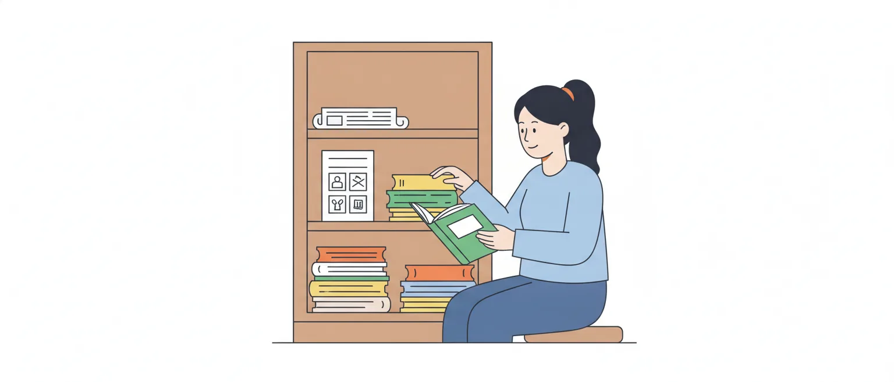

# Tipos textuais, figuras de linguagem, denotação e conotação

O edital pede a **identificação** de três coisas: o tipo de um texto, as figuras de linguagem e o sentido (literal ou figurado) em que uma palavra foi usada. Não é preciso decorar listas enormes. É preciso reconhecer cada fenômeno num trecho e, principalmente, não aceitar o nome certo colado na coisa errada, que é o molde preferido da banca.

## Tipo textual não é gênero textual

**Tipo textual** é o modo de organizar o texto por dentro: contar, descrever, explicar, defender uma ideia ou orientar uma ação. Os tipos são poucos e se reconhecem por marcas linguísticas (tempos verbais, presença de personagens, de opinião, de ordens).

**Gênero textual** é o texto como ele circula na vida real, com nome, finalidade e formato próprios: ata, ofício, notícia, e-mail, edital, receita, crônica, artigo de opinião, manual. Os gêneros são muitos e mudam com o tempo.

Um gênero é construído com um ou mais tipos. Exemplos de um setor administrativo:

- o **manual** de uso do sistema de protocolo é um gênero; o tipo que predomina nele é o injuntivo;
- a **crônica** que um servidor publica no jornal interno é um gênero; nela costuma predominar a narração;
- a **notícia** publicada no site do conselho é um gênero; o **artigo de opinião** é outro.

> [!CAUTION]
> O item diz "tipo textual notícia" ou "gênero narrativo", ou acerta o tipo e erra o gênero na mesma frase. Leia as duas metades. Se uma estiver errada, o item inteiro está errado.

## Os tipos textuais

Os materiais de estudo trabalham com cinco: narrativo, descritivo, dissertativo-expositivo, dissertativo-argumentativo e injuntivo. Há fontes que chamam o dissertativo-expositivo apenas de "expositivo" e o dissertativo-argumentativo apenas de "dissertativo" ou "argumentativo". Os nomes variam; o que distingue um do outro, não.

### Narrativo

Conta fatos que se sucedem no tempo. Tem narrador, personagens, tempo e espaço, e os verbos de ação aparecem, em geral, no pretérito perfeito.

> A servidora abriu o processo, conferiu os documentos e encaminhou tudo à gerência. Dois dias depois, o pedido voltou com uma exigência.

Gêneros em que costuma predominar: conto, crônica, romance, fábula, novela.

### Descritivo

Faz o retrato de um ser, de um objeto, de um lugar ou de uma cena. O tempo "para": em vez de ações que avançam, há características. Marcas: adjetivos, verbos de ligação (ser, estar, parecer), presente ou pretérito imperfeito.

> A sala de atendimento é pequena e clara. Há três guichês, um painel de senhas e cadeiras azuis encostadas na parede.

A descrição pode ser objetiva (só características) ou subjetiva (com as impressões de quem descreve: "a sala acolhedora").

### Dissertativo-expositivo

Apresenta e explica um assunto, sem tomar partido. Traz conceitos, dados, definições e exemplos, em linguagem objetiva.

> O registro profissional é o ato que habilita o profissional a exercer a profissão. Ele é feito no conselho do estado em que o interessado reside.

Gêneros em que costuma predominar: verbete, texto didático, seminário, palestra.

### Dissertativo-argumentativo

Defende um ponto de vista (a tese) com argumentos e procura convencer o leitor. Marcas: opinião, juízo de valor, conectores de causa, oposição e conclusão (porque, no entanto, portanto).

> O atendimento presencial não deve ser extinto. Parte do público não tem acesso à internet, e é dever do órgão alcançar todos os que precisam dele.

Gêneros em que costuma predominar: artigo de opinião, editorial, resenha crítica, redação de concurso.

> [!IMPORTANT]
> A diferença entre os dois dissertativos é uma só: **há ou não há defesa de opinião**. Texto que só informa é expositivo; texto que quer convencer é argumentativo.

### Injuntivo

Orienta o leitor a fazer algo: instrui, ordena, aconselha. Também aparece com o nome de **instrucional**: numa prova de 2016 para Assistente Administrativo (CRC-PR), a Quadrix falou em "texto instrucional" ao lado de "verbos no imperativo".

Marcas: verbos no imperativo ("acesse", "preencha") ou no infinitivo com valor de ordem ("preencher o formulário"), frases curtas, passos em sequência.

> Acesse o sistema com o seu número de registro. Confira o endereço e anexe o comprovante.

Gêneros em que costuma predominar: manual de instruções, receita, bula, regulamento.

## "Não existe tipo puro": a classificação é por predominância

Textos reais misturam sequências. Uma crônica narra, mas para a história para descrever um lugar. Um comunicado informa e, no fim, dá instruções. Um artigo de opinião conta um caso para sustentar a tese. Por isso se pergunta qual tipo **predomina**, ou de que tipo é determinado **trecho**.

Na figura, os cinco tipos, os gêneros em que cada um costuma predominar e, tracejados, esses três exemplos de mistura:

![Quadro com os cinco tipos textuais e, ao lado de cada um, os gêneros em que costuma predominar. Narrativo, que conta fatos no tempo: conto, crônica, romance, fábula e novela; tracejado, o artigo de opinião, que conta um caso para sustentar a tese. Descritivo, que faz o retrato e em que o tempo “para”: tracejada, a crônica, que para a história para descrever um lugar. Dissertativo-expositivo, que explica sem tomar partido: verbete, texto didático, seminário e palestra. Dissertativo-argumentativo, que defende uma tese: artigo de opinião, editorial, resenha crítica e redação de concurso. Injuntivo, ou instrucional, que orienta uma ação: manual de instruções, receita, bula e regulamento; tracejado, o comunicado, que no fim dá instruções.](imagens/tipos-e-generos.svg "Poucos tipos, muitos gêneros: classifica-se pelo tipo que predomina")

Daí saem três cuidados:

- desconfie de "exclusivamente", "puramente", "apenas" e "sem qualquer marca de" em item de tipologia: basta uma sequência de outro tipo para derrubar o item;
- um detalhe isolado não define o tipo. Uma data não faz um texto narrativo; um adjetivo não o faz descritivo; um verbo no imperativo não o faz injuntivo. O que conta é a finalidade do conjunto;
- confira a justificativa. A banca gosta de dar a classificação certa com o motivo errado ("é argumentativo porque usa linguagem figurada") ou a classificação errada com um motivo verdadeiro ("é narrativo porque traz uma data").

## Denotação e conotação

**Denotação** é o uso da palavra no sentido próprio, literal, o do dicionário. **Conotação** é o uso no sentido figurado, que só se entende pelo contexto.

- "O técnico trocou a **chave** da porta do arquivo." (denotação: o objeto)
- "A organização é a **chave** de um bom atendimento." (conotação: o que resolve, o que dá acesso)

A linguagem denotativa predomina nos textos que precisam de precisão (notícia, manual, bula, texto científico, ato oficial). A conotativa é comum na literatura, na publicidade, nas charges e na conversa do dia a dia. São tendências, não regras: uma notícia pode trazer uma expressão figurada, e um poema pode ter versos literais.

Dois pontos que rendem item:

- **nenhuma palavra é denotativa ou conotativa sozinha.** É o contexto que decide. "Caiu" é literal em "o processo caiu da mesa" e figurado em "o sistema caiu";
- **várias figuras se constroem com o sentido figurado, mas não todas.** Ao reconhecer uma metáfora, uma metonímia ou uma hipérbole, você já sabe que o termo está em sentido conotativo. Já a antítese pode ser feita só com palavras em sentido literal ("Uns entram, outros saem"), e as figuras de sintaxe e de som mexem com a construção e com a sonoridade, não com o significado.

## Figuras de linguagem, aos pares que se confundem

Figuras de linguagem são recursos que tornam a expressão mais enfática ou mais expressiva. Costumam ser divididas em figuras de palavra (mexem com o significado), de pensamento (mexem com as ideias), de sintaxe ou construção (mexem com a estrutura da frase) e de som (exploram a sonoridade das palavras).

Os pares abaixo são os que mais se confundem; depois deles, uma tabela reúne outras figuras, entre elas as de som.

### Metáfora × comparação

As duas aproximam dois elementos por semelhança.

- **Comparação**: o conectivo aparece (como, tal qual, feito, que nem). "O arquivo é **como** um labirinto."
- **Metáfora**: o conectivo não aparece; um termo é dito no lugar do outro, ou igualado a ele. "O arquivo é um labirinto."

Teste: achou "como" (ou equivalente) ligando os dois elementos, é comparação.

### Metáfora × metonímia

- **Metáfora**: troca por **semelhança**. Os dois elementos não têm ligação real; quem fala é que vê algo parecido entre eles.
- **Metonímia**: troca por **proximidade**, por uma relação real entre os dois: o autor pela obra ("ler Machado de Assis"), a parte pelo todo ("faltam braços no setor", em vez de trabalhadores), o recipiente pelo conteúdo ("tomou dois copos"), a marca pelo produto, o lugar pela instituição ("Brasília decidiu").

Teste: se cabe "é como se fosse", é metáfora; se cabe "que pertence a", "feito por" ou "que está em", é metonímia.

### Catacrese

É a metáfora que o uso desgastou: a palavra é emprestada porque não há outra mais específica, e ninguém mais percebe a figura. "Pé da mesa", "braço da cadeira", "boca do fogão", "embarcar no avião".

> [!CAUTION]
> Na prova, a catacrese costuma aparecer como nome errado para outro fenômeno. Ela é sempre o emprego de uma **palavra** em sentido emprestado; nunca é omissão nem repetição de termos.

### Personificação (prosopopeia)

Atribui ação, fala ou sentimento humano a seres inanimados ou irracionais. "O relógio do saguão vigia os atrasados." "A impressora se recusou a trabalhar."

## Hipérbole, eufemismo, ironia, antítese e paradoxo

### Hipérbole × eufemismo

- **Hipérbole**: exagero intencional. "Já expliquei isso mil vezes." "Morri de rir."
- **Eufemismo**: suavização de algo desagradável. "Ele nos deixou" (morreu). "O servidor faltou com a verdade" (mentiu).

Uma aumenta, o outro abranda.

### Eufemismo × ironia

- **Eufemismo**: diz o mesmo, com palavras mais leves. O sentido continua na mesma direção.
- **Ironia**: diz o **contrário** do que se pensa, para criticar ou fazer graça. "Que beleza: o sistema caiu de novo." Só o contexto revela a ironia.

### Antítese × paradoxo

- **Antítese**: aproxima palavras ou ideias opostas, que continuam separadas e fazem sentido lado a lado. "Uns entram, outros saem." "O atendimento abre cedo e fecha tarde."
- **Paradoxo**: junta ideias opostas **no mesmo ser, ao mesmo tempo**, formando uma aparente contradição. "Um silêncio ensurdecedor." "Na reunião, ele estava presente e ausente ao mesmo tempo."

> [!TIP]
> Teste: na antítese há contraste; no paradoxo, um aparente absurdo lógico.

## Elipse, zeugma, pleonasmo e anáfora

### Elipse × zeugma

As duas são omissões.

- **Elipse**: omite um termo que **não apareceu antes**, mas se subentende com facilidade. "Sobre a mesa, dois processos." (havia) "Chegamos cedo." (nós)
- **Zeugma**: omite um termo que **já foi dito antes**. "Eu conferi os documentos; ela, as assinaturas." (ela conferiu)

Zeugma é, portanto, um caso particular de elipse. A vírgula no lugar do verbo omitido é uma pista frequente.

### Pleonasmo

Repetição de uma ideia já expressa. Quando reforça de propósito, é figura: "Vi com meus próprios olhos." "A mim, ninguém me avisou." Quando é redundância sem função, é vício de linguagem (pleonasmo vicioso): "subir para cima", "entrar para dentro", "sair para fora".

### Anáfora

Repetição da mesma palavra ou expressão no **início** de frases, orações ou versos. "Falta pessoal, falta espaço, falta tempo." Não confunda com o pleonasmo: na anáfora repete-se a palavra; no pleonasmo, a ideia.

> [!WARNING]
> No estudo da coesão textual, "anáfora" também é o nome da retomada de um termo anterior por um pronome ("o processo... **ele**"). Neste tópico, o edital fala da figura de linguagem.

## Outras figuras, em uma linha cada

| Figura | Grupo | O que é | Exemplo |
|---|---|---|---|
| Sinestesia | palavra | mistura sensações de sentidos diferentes | "A voz macia da atendente acalmou a fila." (audição e tato) |
| Gradação | pensamento | ideias em progressão, crescente ou decrescente | "O usuário pediu, insistiu, exigiu." |
| Hipérbato | sintaxe | inversão da ordem direta da frase | "Dos prazos ninguém na sala se lembrava." |
| Polissíndeto | sintaxe | repetição do conectivo | "E conferia, e carimbava, e assinava." |
| Assíndeto | sintaxe | omissão do conectivo | "Conferiu, carimbou, assinou." |
| Aliteração | som | repetição de sons de consoante | "O protocolo parou por pura pressa." |
| Assonância | som | repetição de sons de vogal | "A pasta parada na sala calada." |
| Onomatopeia | som | palavra que imita um som | "O tique-taque do relógio do saguão." |

Polissíndeto e assíndeto são opostos, como aliteração (consoante) e assonância (vogal). Não confunda o assíndeto com a elipse: nele, o que falta é só o conectivo.

## Como a banca cobra

A Quadrix trabalha com itens de certo ou errado, de uma frase, quase sempre presos a um trecho do texto. Os moldes mais prováveis para este tópico:

- **tipo e gênero na mesma assertiva.** Um dos dois vem trocado, ou vêm invertidos ("gênero injuntivo", "tipo textual crônica");
- **o nome de uma figura dado a outro fenômeno.** O trecho citado tem mesmo algo a notar (uma omissão, uma repetição, um exagero), mas o nome é o da figura vizinha, ou de uma que nada tem a ver;
- **classificação certa, justificativa errada.** "Há metáfora, pois a aproximação é feita por meio de conectivo";
- **sentido literal por figurado**, e vice-versa, com a palavra entre aspas e a remissão à linha;
- **absolutos.** "Exclusivamente narrativo", "apenas em sentido denotativo", "sempre conotativa".

> [!TIP]
> É dica de estudo, e não regra da gramática: diante de um item de figura, pergunte primeiro o que acontece no trecho (troca de sentido, exagero, contradição, omissão, repetição) e só depois confira o nome. Como cada erro tira um ponto, se o nome da figura não lhe disser nada e você não conseguir eliminar pela descrição, pese bem antes de marcar.

## Fontes

- Daniela Diana, "Tipologia textual", Toda Matéria: https://www.todamateria.com.br/tipologia-textual/
- Márcia Fernandes, "Figuras de linguagem", Toda Matéria: https://www.todamateria.com.br/figuras-de-linguagem/
- Márcia Fernandes, "Denotação e Conotação", Toda Matéria: https://www.todamateria.com.br/conotacao-e-denotacao/
- Kassio Henrique Sobral Rocha, "Figuras de linguagem: o que são, tipos, quando usar e exemplos", Estratégia Concursos: https://concursos.estrategia.com/portal/figuras-de-linguagem/
- Instituto Quadrix, caderno de provas de Assistente Administrativo do CRC-PR, Concurso Público nº 1/2016, questão 1 (uso do termo "instrucional"; nada foi reproduzido além dessas palavras): https://www.crcpr.org.br/data/concurso-publico/2026-03-16%20-%20DLC80%20-%202016-Documentos-21-Caderno%20de%20provas%20-%20Assistente%20Administrativo.pdf
- Edital nº 1/2026 do CAU/TO (Instituto Quadrix), Anexo II, Língua Portuguesa, item 1.2.

Consultadas em 10/10/2026. As definições seguem essas fontes. Os exemplos com situações de trabalho e as dicas de prova são deste material; alguns exemplos curtos são de uso corrente em gramáticas e sites de estudo (como "pé da mesa", "subir para cima", "ler Machado de Assis" e "morri de rir").
