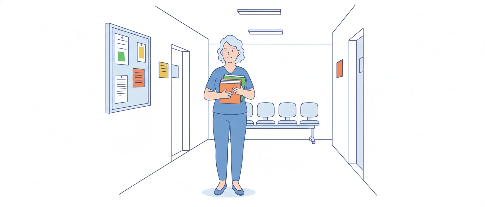

# Ética na função pública e princípios da Administração Pública

O edital pede dois assuntos neste tópico: o **conceito de ética na função pública** (item 1.1) e os **princípios fundamentais da Administração Pública** (item 1.2). O primeiro é conceitual; o segundo é cobrado quase sempre pela letra do art. 37 da Constituição Federal e do art. 2º da Lei nº 9.784/1999.

Nos dois, a banca costuma errar o item com uma troca pequena: uma palavra a mais numa lista, a definição de um conceito colada no vizinho, um "apenas" ou um "sempre".

## Ética e moral

As duas palavras têm origens diferentes e um sentido de origem parecido. "Ética" vem do grego *ethos*; "moral" vem do latim *mores*. Ambas remetem a hábito ou costume. Por isso, na linguagem do dia a dia, são usadas como sinônimos. Para estudar, vale a distinção que a apostila da Enap adota:

| | Moral | Ética |
|---|---|---|
| O que é | O conjunto de normas e valores estabelecidos e transmitidos por um grupo social | A conduta que se consegue justificar racionalmente; como disciplina (a Ética, ou filosofia moral), o estudo que examina as normas morais |
| Pergunta típica | "O que se costuma fazer aqui?" | "Isso que se costuma fazer está certo? Por quê?" |
| Alcance | Varia conforme o grupo, o lugar e a época | Busca razões que valham para qualquer pessoa |

Três consequências dessa distinção:

1. **Costume não é justificativa.** Uma conduta pode ser comum num grupo e, mesmo assim, ser antiética. A apostila da Enap dá dois exemplos: furar fila e empregar parentes em funções públicas sem concurso. "Todo mundo faz" explica o comportamento, mas não o torna correto.
2. **A ética examina a moral.** Não é o contrário: é a reflexão ética que avalia se as regras morais de um grupo se sustentam.
3. **Dois testes simples de justificação**, apresentados pela Enap: a *coerência* (não agir contra aquilo que se defende) e a *universalização* (se eu não aceitaria que todos fizessem o mesmo, minha conduta não se justifica).

> [!CAUTION]
> A pegadinha típica é inverter as definições ("a moral é a reflexão teórica sobre a ética") ou afirmar que a conduta é ética *porque* é habitual.

## Ética na função pública

Quem exerce função pública decide sobre dinheiro, direitos e interesses que não são seus. Por isso, a exigência ética é maior do que a de uma relação privada, e ela não fica só no plano dos bons conselhos: a Constituição e a lei transformaram padrões éticos em dever jurídico.

- O art. 37, caput, da Constituição Federal põe a **moralidade** entre os princípios que toda a Administração deve obedecer, ao lado da legalidade. São dois princípios distintos: um ato pode cumprir a forma da lei e, ainda assim, ofender a moralidade.
- A Lei nº 9.784/1999 manda observar, nos processos administrativos, a "atuação segundo padrões éticos de probidade, decoro e boa-fé" (art. 2º, parágrafo único, IV).

> [!IMPORTANT]
> Em resumo: na função pública, **não basta ser legal; é preciso ser honesto, leal e voltado ao interesse público**.

**No CAU.** A Lei nº 12.378/2010 criou o CAU/BR e os CAU dos estados e do Distrito Federal como autarquias, com personalidade jurídica de direito público (art. 24). Os empregados são contratados por concurso público, sob o regime da CLT (art. 41).

Ou seja: o assistente administrativo do CAU/TO é empregado celetista, mas trabalha numa entidade pública e, por isso, está sujeito aos princípios da Administração Pública.

**Exemplo.** Um assistente do setor de atendimento recebe, no mesmo dia, o requerimento de um desconhecido e o de um amigo. Passar o do amigo na frente, sem previsão em norma, pode até não deixar rastro nos registros, mas viola a impessoalidade e a moralidade.

## Princípios expressos: art. 37, caput, da Constituição

O texto vigente (redação da Emenda Constitucional nº 19/1998) diz que a administração pública **direta e indireta**, de **qualquer dos Poderes** da União, dos estados, do Distrito Federal e dos municípios, obedecerá aos princípios de **legalidade, impessoalidade, moralidade, publicidade e eficiência**. A sigla é LIMPE.

Dois pontos de letra de lei:

- **A lista tem cinco princípios, nessa ordem.** A eficiência não estava no texto original de 1988: foi incluída pela Emenda Constitucional nº 19/1998.
- **O alcance é amplo:** os três Poderes, todas as esferas, administração direta e indireta. Uma autarquia, como o CAU, é administração indireta.

Na figura, os cinco, na ordem, cada um com uma frase curta:

![Cinco cartões lado a lado, com as iniciais L, I, M, P e E. Legalidade: o agente público só pode fazer o que a lei autoriza; o particular pode fazer tudo o que a lei não proíbe. Impessoalidade, com três faces: finalidade pública, igualdade de tratamento e vedação à promoção pessoal. Moralidade: honestidade, lealdade e boa-fé, além do cumprimento formal da lei. Publicidade: atos divulgados, para que produzam efeitos e possam ser controlados; tem exceção, o sigilo previsto na Constituição. Eficiência: bons resultados, com qualidade, rapidez e economia de recursos; incluída pela Emenda Constitucional nº 19/1998. Embaixo: valem para a administração direta e indireta, de qualquer dos Poderes, em todas as esferas.](imagens/limpe.svg "LIMPE: legalidade, impessoalidade, moralidade, publicidade e eficiência")

### Legalidade

O particular pode fazer tudo o que a lei não proíbe: ninguém é obrigado a fazer ou deixar de fazer algo senão em virtude de lei (Constituição, art. 5º, II). Para a Administração, a lógica se inverte: o agente público **só pode fazer o que a lei autoriza**. É a formulação clássica da doutrina, associada a Hely Lopes Meirelles.

*Exemplo:* o CAU/TO não pode criar, por decisão de um setor, uma taxa que a lei não prevê, por mais útil que pareça.

### Impessoalidade

Tem três faces que a banca costuma separar:

- **Finalidade pública:** o ato busca o interesse público, não o do agente nem o de terceiros.
- **Igualdade de tratamento:** sem favorecer nem perseguir. O concurso público (art. 37, II) e a licitação (art. 37, XXI, que exige igualdade de condições a todos os concorrentes) são aplicações diretas.
- **Vedação à promoção pessoal:** a publicidade dos atos, programas, obras, serviços e campanhas dos órgãos públicos deve ter caráter educativo, informativo ou de orientação social, e dela não podem constar nomes, símbolos ou imagens que caracterizem promoção pessoal de autoridades ou servidores públicos (art. 37, § 1º).

> [!CAUTION]
> O art. 37, § 1º, fala de *publicidade* (propaganda institucional), mas o princípio que ele protege é a **impessoalidade**. Itens que atribuem essa vedação ao princípio da publicidade ou da eficiência trocam o conceito pelo vizinho.

## Moralidade, publicidade e eficiência

### Moralidade

Exige honestidade, lealdade e boa-fé, além do cumprimento formal da lei.

O exemplo mais cobrado é a vedação ao nepotismo: a Súmula Vinculante nº 13 do STF diz que viola a Constituição a nomeação de cônjuge, companheiro ou parente até o **terceiro grau**, inclusive, da autoridade nomeante (ou de servidor da mesma pessoa jurídica investido em cargo de direção, chefia ou assessoramento) para cargo em comissão, de confiança ou função gratificada.

### Publicidade

Os atos da Administração devem ser divulgados, para que produzam efeitos e possam ser controlados.

Não é princípio absoluto: a Constituição garante o direito de receber informações dos órgãos públicos, mas ressalva aquelas cujo sigilo seja imprescindível à segurança da sociedade e do Estado (art. 5º, XXXIII). A Lei nº 9.784/1999 fala em "divulgação oficial dos atos administrativos, ressalvadas as hipóteses de sigilo previstas na Constituição" (art. 2º, parágrafo único, V).

**Pegadinha típica:** "todos os atos administrativos devem ser publicados, sem exceção".

### Eficiência

A Administração deve atingir bons resultados com qualidade, rapidez e economia de recursos. Eficiência não autoriza descumprir a lei para "ganhar tempo": os cinco princípios valem juntos.

## Princípios implícitos e princípios previstos em lei

Além dos cinco do art. 37, a Administração obedece a princípios que a Constituição não enumera no caput. Alguns estão escritos em lei; outros são reconhecidos pela doutrina e pela jurisprudência. **Não há hierarquia** entre princípios expressos e implícitos: todos obrigam.

### Os dois pilares do regime administrativo

- **Supremacia do interesse público sobre o privado:** fundamenta as prerrogativas da Administração (por exemplo, fiscalizar e aplicar sanções previstas em lei).
- **Indisponibilidade do interesse público:** fundamenta as restrições. O agente administra o que não é dele; não pode abrir mão de competências nem de recursos por vontade própria. A Lei nº 9.784/1999 veda "a renúncia total ou parcial de poderes ou competências, salvo autorização em lei" (art. 2º, parágrafo único, II).

**Pegadinha típica:** trocar os dois. Prerrogativa vem da supremacia; restrição vem da indisponibilidade.

### A lista do art. 2º da Lei nº 9.784/1999

O caput diz que a Administração Pública obedecerá, **dentre outros**, aos princípios da:

> legalidade, finalidade, motivação, razoabilidade, proporcionalidade, moralidade, ampla defesa, contraditório, segurança jurídica, interesse público e eficiência.

São onze. A expressão "dentre outros" mostra que a lista é exemplificativa.

| | Art. 37, caput, da Constituição | Art. 2º, caput, da Lei nº 9.784/1999 |
|---|---|---|
| Nas duas listas | legalidade, moralidade, eficiência | legalidade, moralidade, eficiência |
| Só numa delas | impessoalidade, publicidade | finalidade, motivação, razoabilidade, proporcionalidade, ampla defesa, contraditório, segurança jurídica, interesse público |

> [!CAUTION]
> **A pegadinha mais provável do tópico:** dizer que a impessoalidade ou a publicidade estão *expressas no caput* do art. 2º da Lei nº 9.784/1999. Não estão. Elas aparecem apenas como *critérios* no parágrafo único: a objetividade no atendimento do interesse público, vedada a promoção pessoal de agentes ou autoridades (inciso III), e a divulgação oficial dos atos (inciso V).
>
> A troca inversa também aparece: dizer que razoabilidade ou motivação estão no caput do art. 37 da Constituição.

## O que cada princípio significa

- **Finalidade:** o ato deve atender ao fim público previsto na norma.
- **Motivação:** indicar os pressupostos de fato e de direito da decisão (art. 2º, parágrafo único, VII). O art. 50 lista os atos que devem ser motivados, como os que negam, limitam ou afetam direitos, os que impõem sanções e os que decidem recursos. A motivação deve ser **explícita, clara e congruente** (art. 50, § 1º).
- **Razoabilidade e proporcionalidade:** adequação entre meios e fins, vedada a imposição de obrigações, restrições e sanções em medida superior àquelas estritamente necessárias ao atendimento do interesse público (art. 2º, parágrafo único, VI).
- **Contraditório e ampla defesa:** assegurados aos litigantes em processo judicial **ou administrativo** (Constituição, art. 5º, LV).
- **Segurança jurídica:** estabilidade das relações. A lei veda aplicar retroativamente uma nova interpretação da norma (art. 2º, parágrafo único, XIII).
- **Autotutela** (não está na lista do art. 2º, mas está no art. 53 e na Súmula nº 473 do STF): a Administração revê os próprios atos, sem precisar ir ao Judiciário. Pelo art. 53, ela **deve anular** os atos com vício de legalidade e **pode revogar** os demais, por motivo de conveniência ou oportunidade, respeitados os direitos adquiridos. A Súmula nº 473, mais antiga, diz que a Administração "pode anular" os atos ilegais e acrescenta que a apreciação judicial fica ressalvada em todos os casos.

> [!CAUTION]
> A pegadinha típica da autotutela é trocar os motivos (anulação por conveniência; revogação por ilegalidade). Anula-se o que é **ilegal**; revoga-se o que é legal, mas deixou de ser **conveniente ou oportuno**. Atenção ao comando do item: "segundo a Lei nº 9.784/1999", o verbo da anulação é "deve"; "segundo a Súmula nº 473", é "pode".

*Exemplo de motivação e proporcionalidade:* ao indeferir um requerimento, o CAU precisa dizer os fatos e a norma em que se baseou; "indefiro" sem explicação não atende à lei. E, se a norma permite advertência ou multa para uma falta leve, a sanção mais grave precisa ser justificada pela necessidade.

## Decreto nº 1.171/1994: não está no edital, mas a banca costuma usar

> [!NOTE]
> O edital do CAU/TO **não cita** o Decreto nº 1.171/1994, que aprovou o Código de Ética Profissional do Servidor Público Civil do Poder Executivo Federal. Em outras provas, porém, a Quadrix usa esse código nos itens rotulados como "ética no setor público".
>
> **Dica de estudo (não é regra do edital):** dedique a este decreto uma leitura dos incisos I a XV. O grosso do tempo vai para as partes anteriores, que são o que o edital pede.

Vale conhecer as ideias centrais, sem decorar o texto inteiro:

- **Honestidade, e não só legalidade.** O servidor não decide apenas entre o legal e o ilegal, o justo e o injusto, o conveniente e o inconveniente, o oportuno e o inoportuno, mas **principalmente entre o honesto e o desonesto** (inciso II).
- **Moralidade e bem comum.** A moralidade não se limita à distinção entre o bem e o mal: soma-se a ideia de que o fim é sempre o bem comum (inciso III).
- **Vida privada conta.** A função pública se integra à vida particular do servidor; fatos da vida privada podem acrescer ou diminuir seu bom conceito na vida funcional (inciso VI).
- **Publicidade.** Salvo sigilo declarado nos termos da lei, a publicidade do ato é requisito de eficácia e moralidade (inciso VII).
- **Verdade.** Toda pessoa tem direito à verdade; o servidor não pode omiti-la nem falseá-la, ainda que contrária aos interesses da própria pessoa interessada ou da Administração (inciso VIII).
- **Filas e atrasos.** Deixar alguém à espera de solução que compete ao setor é tratado como grave dano moral aos usuários (inciso X).
- **Deveres (inciso XIV) e vedações (inciso XV).** Entre as vedações: usar o cargo para obter favorecimento para si ou para outrem e receber vantagem de qualquer espécie para cumprir a própria missão.
- **Pena.** A comissão de ética aplica uma única pena: a **censura** (inciso XXII).
- **Conceito amplo de servidor.** Para o código, é servidor todo aquele que presta serviços de natureza permanente, temporária ou excepcional, **ainda que sem retribuição financeira**, ligado direta ou indiretamente a qualquer órgão do poder estatal, e o texto cita as autarquias (inciso XXIV).

**Incisos revogados.** O texto compilado do Planalto mostra como revogados pelo Decreto nº 6.029/2007 os incisos **XVII, XIX, XX, XXI, XXIII e XXV**, todos do capítulo das comissões de ética. Continuam no texto os incisos XVI, XVIII, XXII e XXIV.

## Resumo das pegadinhas

- Ética e moral com as definições trocadas; "é ético porque é costume".
- "Legal, logo ético": legalidade e moralidade são princípios distintos.
- Legalidade da Administração descrita com a regra do particular ("pode fazer o que a lei não proíbe").
- Lista do art. 37 com um princípio a mais ou a menos; eficiência atribuída ao texto original de 1988.
- Impessoalidade e publicidade colocadas no caput do art. 2º da Lei nº 9.784/1999; razoabilidade e motivação colocadas no caput do art. 37.
- Art. 37, § 1º, ligado ao princípio errado.
- Publicidade sem exceções.
- Supremacia e indisponibilidade trocadas.
- Anular e revogar com os motivos trocados.
- Nepotismo com o grau de parentesco alterado (o correto é até o terceiro grau, inclusive).

## Fontes

- Constituição da República Federativa do Brasil de 1988, arts. 5º (II, XXXIII e LV) e 37 (caput, II, XXI e § 1º). Presidência da República. https://www.planalto.gov.br/ccivil_03/constituicao/constituicao.htm
- Lei nº 9.784, de 29 de janeiro de 1999, arts. 2º, 50 e 53. Presidência da República. https://www.planalto.gov.br/ccivil_03/leis/l9784.htm
- Lei nº 12.378, de 31 de dezembro de 2010, arts. 24 e 41. Presidência da República. https://www.planalto.gov.br/ccivil_03/_ato2007-2010/2010/lei/l12378.htm
- Decreto nº 1.171, de 22 de junho de 1994 (Código de Ética Profissional do Servidor Público Civil do Poder Executivo Federal). Presidência da República. https://www.planalto.gov.br/ccivil_03/decreto/d1171.htm
- Súmula Vinculante nº 13. Supremo Tribunal Federal. https://portal.stf.jus.br/jurisprudencia/sumariosumulas.asp?base=26&sumula=1227
- Súmula nº 473. Supremo Tribunal Federal. https://portal.stf.jus.br/jurisprudencia/sumariosumulas.asp?base=30&sumula=1602
- Ética e serviço público — Módulo 1: conceitos básicos. Cícero Romão e Agnaldo Cuoco Portugal. Escola Nacional de Administração Pública (Enap), 2014. https://repositorio.enap.gov.br/handle/1/1899
- Princípios da Administração Pública – Noções Gerais. Heloísa Tondinelli. Estratégia Concursos, 2021. https://concursos.estrategia.com/portal/principios-administracao-publica-nocoes-gerais/

Textos legais e súmulas consultados em 10/10/2026.
