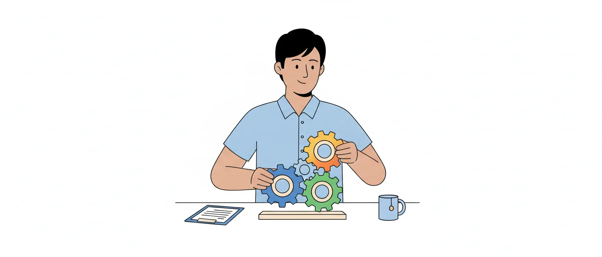

# Funções administrativas: planejamento, organização, direção e controle

> Edital (Conhecimentos Específicos, item 1.1): "Funções administrativas: planejamento, organização, direção e controle."

## Por que este tópico importa

Administrar é fazer uma organização alcançar seus objetivos usando bem as pessoas e os recursos que tem. A doutrina descreve esse trabalho como um **processo**: um conjunto de funções interligadas que todo gestor exerce. Hoje, essas funções são quatro (planejar, organizar, dirigir e controlar), conhecidas pela sigla **PODC**.

Este é um assunto de doutrina, sem lei para decorar. A prova cobra as definições, e o erro mais comum é aceitar a descrição de uma função com o nome de outra. Por isso, mais do que memorizar listas, aprenda a reconhecer cada função pelo que ela faz.

### Eficiência e eficácia

> [!WARNING]
> "Usar bem os recursos" e "alcançar os objetivos" são duas medidas diferentes, e a prova costuma trocar uma pela outra.

A distinção abaixo segue o material didático do IFSC (ver Fontes):

- **eficiência** olha para os **meios**: fazer o trabalho do jeito certo, com o menor gasto de tempo, dinheiro, pessoas e equipamentos;
- **eficácia** olha para os **fins**: escolher o objetivo certo e chegar a ele.

**Exemplo.** O setor que respondeu a todos os pedidos do mês dentro do prazo foi eficaz. Se fez isso sem horas extras e sem retrabalho, foi também eficiente. Se cumpriu o prazo à custa de refazer metade das respostas, foi eficaz, mas pouco eficiente.

## De Fayol ao PODC

Uma das primeiras classificações é a de **Henri Fayol**, da Teoria Clássica, de 1916. Para ele, administrar compreendia **cinco** funções:

1. prever;
2. organizar;
3. comandar;
4. coordenar;
5. controlar.

Mais tarde, os autores da **Teoria Neoclássica** revisaram essa lista. Duas mudanças explicam o PODC:

- **comandar** e **coordenar** foram reunidas em uma só função, a **direção**;
- **prever** passou a ser chamada de **planejar**.

O resultado é o processo administrativo de quatro funções: **planejamento, organização, direção e controle**.

| Fayol (cinco funções) | PODC (quatro funções) |
|---|---|
| Prever | Planejamento |
| Organizar | Organização |
| Comandar e coordenar | Direção |
| Controlar | Controle |

![Quatro cartões em sequência, ligados por setas. P, planejamento: define os objetivos e escolhe os meios para chegar a eles. O, organização: reparte o trabalho e os meios e define autoridade e responsabilidade. D, direção, ou liderança: conduz as pessoas, isto é, liderar, motivar e comunicar. C, controle: acompanha o desempenho, compara com o planejado e corrige os desvios. Uma seta volta do controle ao planejamento: o controle mostra um desvio e leva a rever o planejamento, e daí o ciclo recomeça. Embaixo: as funções interagem e não acontecem isoladas, uma depois da outra, em ordem rígida.](imagens/ciclo-podc.svg "O ciclo PODC: as quatro funções e a volta do controle ao planejamento")

> [!NOTE]
> Alguns autores chamam a terceira função de **liderança** (planejar, organizar, liderar e controlar). É a mesma função com outro nome, e não uma quinta função.

### Pegadinhas

- Dizer que Fayol propôs quatro funções, ou que "dirigir" já estava na lista dele. A lista de Fayol tem cinco funções, e a direção nasce da união de duas delas.
- Dizer que a direção reúne "prever e organizar" ou "organizar e controlar". Ela reúne **comandar e coordenar**.

## Planejamento

Planejar é **definir os objetivos** a alcançar e **escolher os meios** para chegar a eles: estratégias, ações e planos que orientam as atividades da organização. É o ponto de partida do processo, porque as outras três funções trabalham sobre o que foi planejado.

Dois cuidados com o conceito:

- planejar não é adivinhar o futuro: é decidir hoje o que precisa ser feito para a organização chegar aonde quer;
- o plano não é imutável. Ele precisa de flexibilidade para ser ajustado enquanto é executado, quando a organização, a direção ou o controle mostrarem que algo mudou.

### Etapas do planejamento

Na sequência atribuída a Chiavenato, o planejamento tem seis etapas:

1. definir os objetivos;
2. diagnosticar onde a organização está diante desses objetivos;
3. formular premissas sobre o futuro (cenários);
4. levantar e comparar os caminhos possíveis;
5. escolher um deles;
6. pôr o plano em prática e avaliar os resultados.

> [!IMPORTANT]
> Repare na primeira: os objetivos vêm antes de tudo, porque servem de base para os demais planos.

### Tipos de planejamento

O planejamento se desdobra pelos três níveis da organização.

| Tipo | Quem costuma elaborar | Prazo | Alcance |
|---|---|---|---|
| Estratégico | Alta direção (nível estratégico ou institucional) | Longo | A organização como um todo; genérico |
| Tático | Gerências (nível tático ou intermediário) | Médio | Cada área, departamento ou unidade |
| Operacional | Supervisão (nível operacional) | Curto | Tarefas e rotinas; muito detalhado |

O tático traduz o estratégico em ações de cada área, e o operacional detalha o tático no dia a dia.

**Exemplo.** Em um conselho profissional, o plenário e a presidência definem que, em quatro anos, todo o atendimento poderá ser feito por meio digital (estratégico). A gerência administrativa prepara o plano do ano para o setor de atendimento: quais serviços migram primeiro, com que orçamento e com que equipe (tático). O chefe do atendimento monta a escala da semana e o roteiro de respostas aos pedidos recebidos por e-mail (operacional).

### Pegadinhas

- Trocar os prazos: estratégico de curto prazo, operacional de longo prazo.
- Trocar o alcance: dizer que o planejamento tático abrange a organização inteira (isso é o estratégico) ou que o estratégico é detalhado (detalhado é o operacional).
- Dizer que só a alta direção planeja. Há planejamento nos três níveis; o que muda é o prazo, o alcance e o detalhe.

## Organização

A palavra "organização" tem dois sentidos na disciplina:

- a **entidade**: pessoas que trabalham juntas, de forma estruturada, por um mesmo propósito (uma empresa, um conselho, uma prefeitura);
- a **função administrativa**: o ato de organizar. É deste sentido que o edital trata aqui.

Como função, organizar é **repartir o trabalho e os meios disponíveis** (pessoas, dinheiro, equipamentos) entre as pessoas e as unidades e **estabelecer quem manda, quem decide e quem responde pelo quê**. O produto desse trabalho é a **estrutura organizacional**.

A função costuma ser descrita em três passos:

1. **divisão do trabalho**: separar as atividades em cargos e funções;
2. **autoridade e responsabilidade**: fixar quem se reporta a quem (a cadeia de comando);
3. **desenho da estrutura**: escolher como agrupar as unidades (a departamentalização).

> [!NOTE]
> Os tipos de estrutura e de departamentalização são assunto de outra aula. Aqui basta saber que eles são produto da função de organização.

**Exemplo.** Decidido o plano do atendimento digital, a gerência define que dois assistentes cuidarão dos pedidos eletrônicos e um ficará no balcão, quem será o responsável pelo setor, quais computadores e sistemas cada um usará. Isso é organizar.

### Pegadinhas

- Chamar de planejamento a alocação de recursos e a repartição do trabalho. Planejar decide **o que** e **como** fazer; organizar arruma **quem faz** e **com que recursos**.
- Confundir os dois sentidos da palavra no mesmo item.

## Direção

Dirigir é **conduzir as pessoas** para que o trabalho planejado e organizado aconteça. É a função mais ligada às relações humanas: envolve **liderar, motivar e comunicar**, além de orientar e supervisionar a equipe e mediar os desentendimentos entre seus integrantes.

Uma comparação útil: a organização olha para a estrutura formal (cargos, autoridade, recursos); a direção dá mais atenção às pessoas e às relações entre elas, inclusive as informais.

A direção também existe nos três níveis. É comum associar os nomes dos gestores a cada um: **diretores** no nível estratégico, **gerentes** no tático e **supervisores** no operacional.

**Exemplo.** A chefe do atendimento reúne a equipe, explica o novo fluxo, tira dúvidas, reconhece quem cumpriu os prazos e conversa com dois colegas que se desentenderam sobre a divisão dos pedidos. Tudo isso é dirigir.

### Pegadinhas

- Restringir a direção aos "diretores" ou ao topo. O supervisor que orienta a equipe também dirige.
- Atribuir à direção a comparação de resultados com metas (isso é controle) ou a definição da cadeia de comando (isso é organização).

## Controle

Controlar é **conferir se a organização está chegando aos resultados pretendidos**: acompanhar o desempenho, compará-lo com o que foi planejado e corrigir os desvios. Sem controle, as outras três funções perdem o sentido, porque ninguém saberia se deram resultado.

### Etapas do controle

Na sequência atribuída a Chiavenato, o controle tem quatro etapas, nesta ordem:

1. estabelecer os objetivos ou padrões de desempenho;
2. medir (avaliar) o desempenho atual;
3. comparar o desempenho com os padrões;
4. adotar a ação corretiva para os desvios.

### Tipos de controle quanto ao momento

| Tipo | Quando ocorre | Para quê |
|---|---|---|
| Preventivo (ou prévio) | Antes da atividade | Evitar que o desvio aconteça |
| Concomitante | Durante a atividade | Corrigir o problema enquanto o trabalho é feito |
| Posterior | Depois de concluída a atividade | Avaliar os resultados e melhorar as próximas vezes |

**Exemplos.** Conferir, antes de abrir o atendimento, se o sistema está no ar e se os formulários estão atualizados é controle preventivo. Acompanhar a fila ao longo do dia e deslocar um assistente para o balcão quando a espera cresce é controle concomitante. Analisar, no fim do mês, o relatório de pedidos respondidos fora do prazo é controle posterior.

### Características de um bom sistema de controle

A doutrina de concursos atribui a Maximiano uma lista de características do controle eficaz: foco nos pontos estratégicos, precisão, rapidez, objetividade, economia (o controle deve custar menos do que o benefício que traz), aceitação pelas pessoas, ênfase na exceção (atenção aos desvios) e uso de mais de um critério de avaliação.

### Pegadinhas

- Inverter as etapas: a ação corretiva é a **última**, depois da comparação.
- Chamar de planejamento a comparação entre o desempenho real e as metas. Comparar é etapa do **controle**.
- Dizer que o controle só acontece no fim. Ele pode vir antes, durante ou depois.
- Trocar os nomes dos tipos: o que ocorre durante a execução é o concomitante, e não o posterior.

## As quatro funções e os três níveis

Os níveis da organização são três:

- **estratégico** (ou institucional): o topo, que decide pela organização inteira, com visão de longo prazo;
- **tático** (ou intermediário, gerencial): faz a ligação entre o topo e a base e cuida de cada área;
- **operacional**: os gestores de primeira linha, que coordenam quem executa as tarefas do dia a dia, no curto prazo.

> [!IMPORTANT]
> A regra que mais rende itens: **as quatro funções estão presentes nos três níveis**. O que muda é o peso e o alcance de cada uma. O presidente de um conselho planeja, organiza, dirige e controla; o chefe de um setor também, em escala menor.

Outra ideia cobrada: o processo é chamado de **ciclo**, mas as funções não acontecem isoladas, uma depois da outra, em ordem rígida. Elas interagem. É comum que o controle mostre um desvio e leve a rever o planejamento, e daí o ciclo recomeça.

### Pegadinhas

- "O planejamento cabe apenas ao nível estratégico", "o controle é exclusivo do nível operacional", "somente a alta administração dirige": desconfie dos absolutos. Nenhuma função é exclusiva de um nível.
- "As funções são independentes entre si": elas são interdependentes.

## Como identificar a função em um item

> [!TIP]
> Dica de estudo (não é classificação de autor): procure o verbo principal da descrição.

| Se a descrição fala em… | A função é… |
|---|---|
| definir objetivos, traçar estratégias, elaborar planos | Planejamento |
| dividir o trabalho, alocar recursos, definir autoridade e responsabilidade, montar a estrutura | Organização |
| liderar, motivar, comunicar, orientar, supervisionar pessoas | Direção |
| estabelecer padrões, medir, comparar, corrigir desvios | Controle |

Depois confira os detalhes: o nome da função, o nível hierárquico, o prazo e a presença de palavras como "apenas", "somente", "sempre" e "exclusivamente".

## Fontes

- Paulo Alvarenga Pires Cavalcanti (Estratégia Concursos). *Funções do Processo Administrativo para concursos – Guia Definitivo*. https://concursos.estrategia.com/portal/funcoes-processo-administrativo-para-concursos-guia-definitivo/
- Renata Araújo Sodré da Silva (Estratégia Concursos). *Funções da Administração para TCE-PR*. https://concursos.estrategia.com/portal/funcoes-administracao-tce-pr/
- Material didático de docente do IFSC. *Capítulo 1 — Introdução à administração e às organizações*. https://docente.ifsc.edu.br/joelma.kremer/MaterialDidatico/Ci%c3%aancia%20da%20Computa%c3%a7%c3%a3o/1_Introdu%c3%a7%c3%a3o%20%c3%a0%20Administra%c3%a7%c3%a3o%20e%20%c3%a0s%20Organiza%c3%a7%c3%b5es.docx
- Bacharelado em Administração Pública (PNAP/UAB), hospedado pelo CESAD/UFS. *Teorias da Administração I — Unidade 2: As funções administrativas e organizacionais*. https://cesad.ufs.br/ORBI/public/uploadCatalago/19101316022012Teorias_da_Administracao_I_Aula_2.pdf

As sequências de etapas do planejamento e do controle (Chiavenato) e as características do controle eficaz (Maximiano) foram conferidas no primeiro artigo, que cita as obras desses autores; os livros não foram consultados diretamente. A distinção entre eficiência e eficácia e a noção de que organizar resulta na estrutura organizacional vêm do material do IFSC, aqui explicadas com outras palavras.
