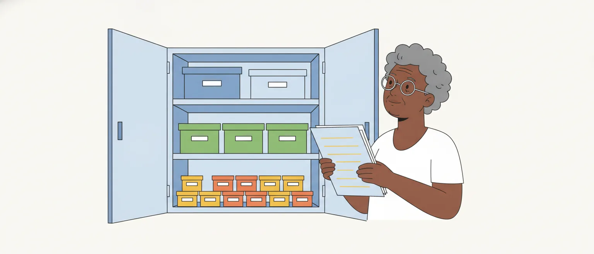

# Gestão de estoque e suprimentos de escritório

> Edital (Conhecimentos Específicos, item 1.5): "Gestão de estoque e suprimentos de escritório."

## Por que este tópico importa

Estoque é todo material guardado para ser usado mais tarde. Num conselho profissional, é o armário ou o almoxarifado onde ficam o papel, as canetas, os envelopes e o toner que os setores vão pedir ao longo do ano.

Gerir o estoque é resolver um dilema: **não pode faltar e não pode sobrar**. Se falta papel, o atendimento para. Se sobra, há dinheiro parado na prateleira, material envelhecendo e espaço ocupado.

A prova cobra este assunto em itens de uma frase, que trocam um conceito pelo vizinho ou invertem uma classificação. A aula tem três blocos: a curva ABC, os níveis de estoque e a rotina de guardar, distribuir e conferir o material.

> [!NOTE]
> O edital não cita norma para este tópico. Usamos como base a Instrução Normativa SEDAP nº 205/1988, escrita para os órgãos federais do Sistema de Serviços Gerais (SISG) e reproduzida pela maioria dos manuais de almoxarifado. A aula não afirma que ela se aplica ao CAU/TO: avisa quando o conceito vem dessa norma e quando vem da doutrina.

## Suprimentos de escritório: o material de expediente

No setor público, o que o edital chama de "suprimentos de escritório" tem nome próprio: **material de expediente**. A Portaria STN nº 448/2002 o descreve como o material usado diretamente nos trabalhos administrativos, nos escritórios públicos, e dá exemplos: papéis, canetas, lápis, borrachas, clipes, grampos, envelopes, pastas, fita adesiva e carimbos.

O material de expediente é um tipo de **material de consumo**: aquele que, com o uso, perde a identidade física ou tem utilização limitada a dois anos (art. 2º da mesma portaria). É o contrário do material permanente, como mesas e armários, que não perde a identidade física e dura mais de dois anos.

A diferença muda o controle. O material de consumo é controlado **no estoque**: entra no almoxarifado, sai por requisição e acaba. O material permanente é controlado **um a um**, com número de patrimônio e termo de responsabilidade.

### Pegadinhas

- Chamar o material de expediente de material permanente, ou dizer que ele recebe número de patrimônio.
- Trocar o prazo de dois anos por outro.

## Por que ter estoque, e quanto ele custa

O ideal seria comprar só na hora de usar. Na prática, a apostila da Enap (Fenili) aponta razões para manter estoque:

- **proteger contra aumentos inesperados do consumo**;
- **proteger contra atrasos** do fornecedor ou da compra, que no setor público costuma demorar;
- **comprar em quantidade maior por preço menor** (economia de escala).

Do outro lado estão os custos. A doutrina separa três, e a banca gosta de trocar um pelo outro:

| Custo | O que é | Quando o estoque aumenta |
|---|---|---|
| De armazenagem | Espaço, seguro, perdas, furtos e material que fica obsoleto | Aumenta |
| De pedido | O trabalho de comprar: pesquisar, licitar, emitir e acompanhar o pedido | Diminui (compra-se menos vezes) |
| De falta | O prejuízo de não ter o material quando alguém precisa (**ruptura de estoque**) | Diminui |

**Exemplo.** Comprar de uma vez o papel do ano inteiro reduz o custo de pedido (uma compra só), mas eleva o de armazenagem. Comprar todo mês faz o contrário.

> [!WARNING]
> Estoque grande não é sinal de boa gestão. A própria IN nº 205/1988 manda evitar a compra volumosa de materiais que perdem as características de uso em pouco tempo ou que ficam obsoletos (item 2.5).

## Curva ABC: o que ela mede

Um almoxarifado tem centenas de itens, e não compensa vigiar todos com o mesmo rigor. A **curva ABC** (também chamada de classificação ABC, princípio de Pareto ou curva 80-20) separa os itens em três classes para dizer **onde concentrar a atenção**.

O critério usual é o **valor de consumo** (ou valor de demanda) de cada item no período:

**valor de consumo = quantidade consumida × preço unitário**

Com os itens postos em ordem, do maior para o menor valor de consumo, formam-se as classes:

| Classe | Quantos itens | Quanto do valor de consumo | Controle |
|---|---|---|---|
| **A** | **Poucos** (cerca de 20%) | **A maior parte** (cerca de 80%) | O mais rigoroso |
| **B** | Intermediário (cerca de 30%) | Intermediário (cerca de 15%) | Intermediário |
| **C** | **Muitos** (cerca de 50%) | **Pequena parte** (cerca de 5%) | O mais simples |

> [!IMPORTANT]
> **Classe A: poucos itens, a maior parte do valor.** Classe C: muitos itens, pequena parte do valor. O que classifica é o valor de consumo, e não o preço unitário nem a quantidade sozinhos.

Os percentuais são **aproximados** e variam de autor para autor e de organização para organização. A apostila da Enap e a cartilha do governo de Minas Gerais usam 80-15-5 para o valor e 20-30-50 para os itens; outros materiais adotam cortes como 75-20-5. O que não muda é a lógica.

## Curva ABC: exemplo passo a passo

O almoxarifado de um conselho consumiu, no ano, dez itens de material de expediente (dados fictícios).

**Passo 1: calcular o valor de consumo de cada item.**

| Item | Consumo no ano | Preço unitário | Valor de consumo |
|---|---|---|---|
| Toner de impressora | 40 | R$ 250,00 | R$ 10.000 |
| Papel A4 (resma) | 240 | R$ 25,00 | R$ 6.000 |
| Envelope (caixa) | 100 | R$ 12,00 | R$ 1.200 |
| Pasta suspensa (caixa) | 50 | R$ 20,00 | R$ 1.000 |
| Caneta (caixa com 50) | 20 | R$ 40,00 | R$ 800 |
| Etiqueta adesiva (pacote) | 20 | R$ 15,00 | R$ 300 |
| Grampo (caixa) | 100 | R$ 2,50 | R$ 250 |
| Clipe (caixa) | 100 | R$ 2,00 | R$ 200 |
| Carimbo automático | 3 | R$ 50,00 | R$ 150 |
| Borracha | 200 | R$ 0,50 | R$ 100 |
| **Total** | | | **R$ 20.000** |

**Passo 2: ordenar do maior para o menor valor de consumo.** A tabela já está nessa ordem.

**Passo 3: ver quanto cada item pesa no total e ir somando.** O toner representa 50% (10.000 ÷ 20.000). Com o papel (30%), o acumulado chega a 80%. Com envelope, pasta e caneta (6%, 5% e 4%), chega a 95%. Os cinco últimos itens somam os 5% que faltam.

**Passo 4: separar as classes.**

- **Classe A**: toner e papel. São 2 itens em 10 (20%) e R$ 16.000 (80% do valor).
- **Classe B**: envelope, pasta e caneta. São 3 itens (30%) e R$ 3.000 (15%).
- **Classe C**: os outros cinco. São 5 itens (50%) e R$ 1.000 (5%).

![Dez barras, uma por item, do maior para o menor valor de consumo. Classe A: toner de impressora, 40 vezes 250 reais, 10.000 reais, acumulado de 50%; papel A4, 240 vezes 25 reais, 6.000 reais, acumulado de 80%. Classe B: envelope, 1.200 reais, 86%; pasta suspensa, 1.000 reais, 91%; caneta, 800 reais, 95%. Classe C: etiqueta adesiva, 300 reais; grampo, 250 reais; clipe, 200 reais; carimbo automático, 150 reais; borracha, 100 reais, acumulado de 100%. Resumo: classe A, 2 itens, 20% dos itens, somam 16.000 reais, 80% do valor; classe B, 3 itens, 30%, somam 3.000 reais, 15%; classe C, 5 itens, 50%, somam 1.000 reais, 5%.](imagens/curva-abc-exemplo.svg "Dois itens concentram 80% do valor de consumo: é a classe A. Dados fictícios")

Agora repare em três itens:

- a **borracha** é o segundo item mais consumido em quantidade (200 unidades) e ficou na classe **C**;
- o **carimbo** tem o segundo maior preço unitário (R$ 50,00) e também ficou na classe **C**, porque só três foram usados;
- o **papel** custa R$ 25,00 a resma, menos que o carimbo, e está na classe **A**.

Nem a quantidade nem o preço unitário decidem a classe: decide o produto dos dois.

## Curva ABC: como a banca inverte

A classificação serve para dosar o controle. Os itens da classe A merecem acompanhamento frequente, compras bem calculadas e pouco tempo parados na prateleira, porque é ali que está o dinheiro. Os da classe C podem ter controle simples e uma reserva maior: custa pouco mantê-los e não vale a pena contá-los toda semana.

> [!CAUTION]
> A inversão clássica: "os itens da classe A são os mais numerosos e os de menor valor". É o contrário. **A = poucos itens e maior valor. C = muitos itens e menor valor.** Antes de julgar o item, confira as duas metades da frase: a quantidade de itens e o valor.

Itens antigos da Quadrix sobre o assunto giram em torno de três trocas. Desconfie quando a assertiva:

- disser que o critério da curva ABC é o **valor unitário** (ou o preço) do item. O critério usual é o **valor de consumo**;
- der a uma classe os **números de outra**: "a classe C responde por cerca de 75% do valor", "a classe B reúne 20% dos itens e 80% do valor";
- pedir **controle mais rigoroso para a classe C**, ou mais simples para a classe A.

Mais dois pontos que podem aparecer:

- o valor de consumo é o critério **usual**, mas não o único possível: a Enap registra que a organização pode adotar outro, como os itens mais requisitados. Um item com "exclusivamente" ou "somente" merece desconfiança;
- a curva ABC não mede o quanto o item é indispensável. Isso é assunto de outra classificação, a **XYZ**, pela criticidade: **X** é o material de baixa criticidade, cuja falta não para o trabalho; **Y**, o intermediário; **Z**, o de máxima criticidade, cuja falta paralisa a atividade.

Um item pode ser C e Z ao mesmo tempo: barato, mas indispensável.

## Níveis de estoque: os conceitos

Para decidir **quando** e **quanto** comprar, a IN nº 205/1988 (item 7.6) define os chamados fatores de ressuprimento. Vale conhecer cada um pelo nome e pela letra.

| Fator | O que é | Como se calcula |
|---|---|---|
| Consumo médio mensal (c) | A média aritmética do consumo nos últimos 12 meses | consumo do ano ÷ 12 |
| Tempo de aquisição (T) | O período entre a emissão do pedido de compra e o recebimento do material no almoxarifado, em meses | observado |
| Intervalo de aquisição (I) | O período entre duas aquisições normais e sucessivas | definido pelo órgão |
| Estoque mínimo ou de segurança (Em) | A menor quantidade a manter, para atender a um consumo acima do previsto ou a um atraso na entrega | Em = c × f |
| Estoque máximo (EM) | A maior quantidade admissível em estoque | EM = Em + c × I |
| Ponto de pedido (Pp) | O nível de estoque que, quando atingido, determina a emissão imediata de um pedido de compra | Pp = Em + c × T |
| Quantidade a ressuprir (Q) | O número de unidades a comprar para recompor o estoque máximo | Q = c × I |

O "f" do estoque mínimo é uma fração do tempo de aquisição: em princípio, de 0,25 a 0,50 de T. E a norma diz que o estoque mínimo se aplica **somente aos itens indispensáveis** aos serviços do órgão.

Um jeito de guardar as duas fórmulas parecidas: o **ponto de pedido** usa o **T**, porque precisa cobrir o consumo enquanto a compra não chega. O **estoque máximo** usa o **I**, porque precisa durar até a compra seguinte.

> [!NOTE]
> Isto é norma federal, e a doutrina varia nos nomes. A IN nº 205/1988 trata estoque mínimo e estoque de segurança como a mesma coisa, e a apostila da Enap também; alguns autores separam os dois. Os nomes "tempo de reposição", "tempo de ressuprimento" e *lead time* equivalem ao tempo de aquisição, e "lote de compra", à quantidade a ressuprir.

### Pegadinhas

- Dizer que o ponto de pedido é o momento em que o estoque **acaba** ou chega ao mínimo. O pedido é feito **antes**, quando ainda há material para o tempo de espera.
- Trocar T por I: definir o tempo de aquisição como "o período entre duas compras".
- Dizer que o estoque mínimo vale para todos os itens.
- Dizer que o consumo médio mensal é a média dos últimos seis meses, ou o maior consumo do período.

## Níveis de estoque: exemplo com o papel A4

Volte ao papel A4 do exemplo anterior: 240 resmas no ano. Suponha que a compra leve dois meses para chegar e que o conselho compre papel a cada quatro meses.

1. **Consumo médio mensal**: c = 240 ÷ 12 = **20 resmas por mês**.
2. **Tempo de aquisição**: T = 2 meses. **Intervalo de aquisição**: I = 4 meses.
3. **Estoque mínimo**: o conselho adota a fração de 0,50 de T, isto é, f = 0,50 × 2 = 1. Em = 20 × 1 = **20 resmas**.
4. **Estoque máximo**: EM = 20 + 20 × 4 = **100 resmas**.
5. **Ponto de pedido**: Pp = 20 + 20 × 2 = **60 resmas**.
6. **Quantidade a ressuprir**: Q = 20 × 4 = **80 resmas**.

Na prática: quando o estoque cair a 60 resmas, o pedido é emitido. Nos dois meses de espera, o setor consome 40 resmas, e o estoque chega a 20, o mínimo. Nesse momento entram as 80 resmas compradas, e o estoque volta a 100.

![Gráfico em dente de serra do estoque de papel A4. O estoque começa em 100 resmas, o estoque máximo, e cai 20 resmas por mês. No mês 2 chega a 60 resmas, o ponto de pedido, e o pedido de compra é emitido. No mês 4 chega a 20 resmas, o estoque mínimo; chegam 80 resmas e o estoque volta a 100. O desenho se repete: novo pedido no mês 6, nova chegada de 80 resmas no mês 8. O tempo de aquisição, T, é de 2 meses, do pedido à entrega. O intervalo de aquisição, I, é de 4 meses, de uma compra à seguinte. A faixa abaixo de 20 resmas é a reserva, que em condições normais não é usada.](imagens/dente-de-serra-papel-a4.svg "O estoque cai, o pedido sai no ponto de pedido e a compra chega quando o estoque atinge o mínimo")

Esse desenho é chamado na doutrina de **curva dente de serra**. Ele representa a **reposição contínua**: compra-se sempre que o estoque atinge o ponto de pedido. Na **reposição periódica**, compra-se em datas fixas a quantidade que falta para chegar ao estoque máximo.

> [!TIP]
> Confira a conta pelo caminho inverso: ponto de pedido menos o consumo da espera tem de dar o estoque mínimo (60 − 40 = 20), e estoque mínimo mais a quantidade a ressuprir tem de dar o estoque máximo (20 + 80 = 100).

## Giro e cobertura de estoque

Dois indicadores da doutrina (aqui, pela apostila da Enap) medem se o estoque está bem dimensionado.

- **Giro de estoque** (ou rotatividade): quantas vezes o estoque se renovou no período. Giro = consumo no período ÷ estoque médio no período.
- **Cobertura de estoque**: por quanto tempo o estoque médio atende ao consumo, se nada for reposto. Cobertura = estoque médio ÷ consumo por unidade de tempo.

**Exemplo.** No caso do papel, o estoque oscila entre 100 e 20 resmas: a média é de 60. O giro no ano é 240 ÷ 60 = **4**. A cobertura é 60 ÷ 20 resmas por mês = **3 meses**.

Giro alto significa menos dinheiro parado e menos custo de armazenagem. Mas giro alto demais reduz a cobertura e aumenta o risco de faltar material, sobretudo quando a compra demora.

### Pegadinhas

- Inverter a fração: giro é consumo sobre estoque médio, e não o contrário.
- Dizer que giro e cobertura crescem juntos. Com o mesmo consumo, quando um sobe, o outro desce.

## Receber, guardar e distribuir

O recebimento já foi visto na aula de administração de materiais. Daqui, guarde uma frase da IN nº 205/1988 (item 3): **receber não é aceitar**. O recebimento só transfere do fornecedor ao órgão a responsabilidade pela guarda do material; a aceitação vem depois da conferência. E o registro de entrada é feito sempre no almoxarifado, qualquer que seja o local da entrega.

Na **armazenagem**, a norma lista cuidados (item 4.1). Os mais cobrados:

- sai primeiro o material estocado há mais tempo: **PEPS, primeiro a entrar, primeiro a sair**, para o estoque não envelhecer;
- nada em **contato direto com o piso**;
- material pesado ou volumoso nas **partes de baixo** das estantes;
- material de grande movimentação em local de **fácil acesso**, perto da saída;
- material conservado na **embalagem original**, aberta só na hora de usar ou de fornecer em partes;
- nada pode obstruir extintores e saídas de emergência.

Na **distribuição**, a norma diz que as unidades são supridas exclusivamente pelo almoxarifado do órgão (item 5) e prevê dois processos:

- **por requisição**: o mais comum. O setor apresenta um pedido de material e recebe o que pediu;
- **por pressão**: de uso facultativo. O almoxarifado entrega quantidades fixadas em tabela, em épocas marcadas, sem esperar pedido. A norma cita o material de expediente de uso rotineiro como exemplo.

> [!WARNING]
> PEPS aparece em dois sentidos. Na armazenagem, é a ordem física de saída: primeiro o mais antigo. Na avaliação de estoques, é um método de calcular o valor da saída pelo preço da compra mais antiga, ao lado do custo médio e do UEPS (último a entrar, primeiro a sair). O item diz qual dos dois está cobrando.

### Pegadinhas

- Dizer que, na armazenagem, o material mais novo sai primeiro, ou que isso é o PEPS.
- Trocar os processos: "por pressão" é o que **não** depende de pedido do usuário.
- Dizer que o recebimento já implica aceitação.

## Inventário físico

Inventário físico é o instrumento de controle que verifica os saldos de estoque nos almoxarifados e os bens permanentes em uso. Serve, entre outras coisas, para **ajustar o saldo dos registros ao saldo físico real** (IN nº 205/1988, item 8).

A norma lista cinco tipos de inventário (item 8.1):

| Tipo | Quando é feito |
|---|---|
| Anual | Comprova a quantidade e o valor dos bens existentes em 31 de dezembro de cada exercício |
| Inicial | Na criação de uma unidade gestora |
| De transferência de responsabilidade | Na mudança do dirigente da unidade gestora |
| De extinção ou transformação | Quando a unidade gestora é extinta ou transformada |
| Eventual | Em qualquer época, por iniciativa do dirigente ou do órgão fiscalizador |

Além deles, a norma admite dois instrumentos gerenciais (item 8.3): o **inventário rotativo**, contínuo e seletivo, feito por programação para que todos os itens sejam contados ao longo do exercício; e o **inventário por amostragem**, para acervos de grande porte, em que se contam amostras de um grupo de itens e se estende o resultado aos demais.

**Exemplo.** Em dezembro, o conselho conta todo o material do almoxarifado: inventário anual. Quando o responsável pelo almoxarifado é substituído em julho, faz-se nova conferência para passar a carga: inventário de transferência de responsabilidade.

### Pegadinhas

- Trocar os nomes: chamar de "inicial" o inventário feito na troca do dirigente, ou de "eventual" o de 31 de dezembro.
- Dizer que o inventário alcança só o estoque ou só os bens permanentes. Alcança os dois.
- Dizer que, no inventário rotativo, só parte dos itens é contada no ano. A programação é feita para alcançar todos.

## Fontes

- Secretaria de Administração Pública da Presidência da República (SEDAP). *Instrução Normativa nº 205, de 8 de abril de 1988*. Texto no Portal de Compras do Governo Federal. https://www.gov.br/compras/pt-br/acesso-a-informacao/legislacao/instrucoes-normativas/instrucao-normativa-no-205-de-08-de-abril-de-1988
- Secretaria do Tesouro Nacional. *Portaria nº 448, de 13 de setembro de 2002*. Cópia hospedada pela Universidade Federal do Espírito Santo. https://proextpg.ufes.br/sites/proextpg.ufes.br/files/field/anexo/custeiocapital.pdf
- Renato Ribeiro Fenili. *Gestão de Materiais* (Enap Didáticos, 2ª edição). Escola Nacional de Administração Pública. https://repositorio.enap.gov.br/handle/1/2449
- Governo de Minas Gerais, Secretaria de Estado de Planejamento e Gestão. *Cartilha de Gestão de Almoxarifados* (2017). https://www.mg.gov.br/sites/default/files/planejamento/documentos/gestao-de-logistica-e-patrimonio/gestao-de-suprimentos/cartilha_gestao_de_almoxarifados_-_final.pdf

Vêm da IN nº 205/1988, conferidos no texto do portal: recebimento e aceitação (item 3), cuidados de armazenagem (4.1), distribuição por pressão e por requisição (5 e 5.1), compra volumosa (2.5), fatores e fórmulas de ressuprimento (7.6 e 7.7) e inventários (8, 8.1 e 8.3). Os anexos da instrução, com o exemplo e o gráfico oficiais, não estão na página consultada e não foram lidos. A definição de material de expediente e a de material de consumo vêm da Portaria STN nº 448/2002, lida em cópia hospedada por universidade.

Vêm da doutrina, pela apostila da Enap: as razões para manter estoque, os custos de estoque, a curva ABC, a classificação XYZ, a reposição contínua e a periódica, o giro, a cobertura e os métodos de avaliação. Os percentuais da curva ABC foram conferidos também na cartilha de Minas Gerais. Os exemplos numéricos (os dez itens e o papel A4) são nossos, com dados fictícios, e as dicas para memorizar as fórmulas são leitura nossa.
